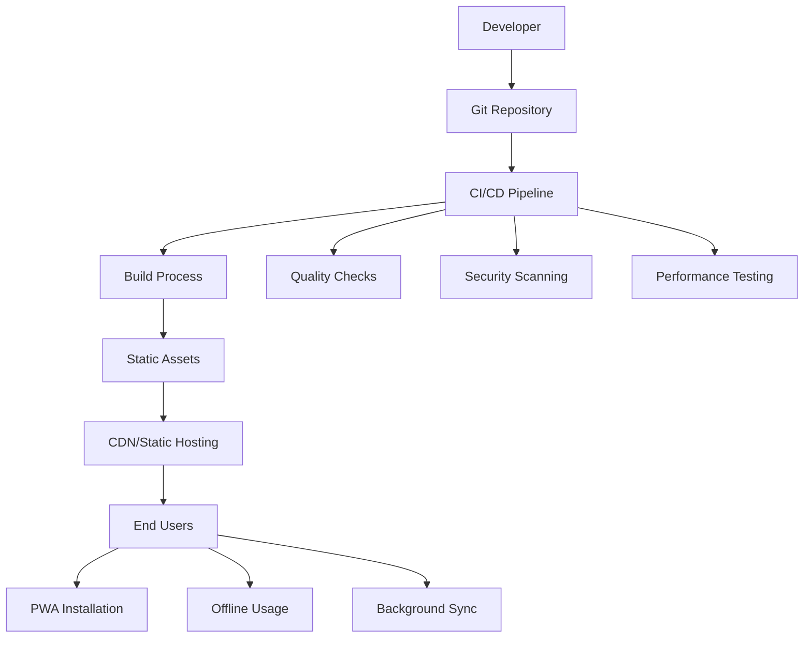
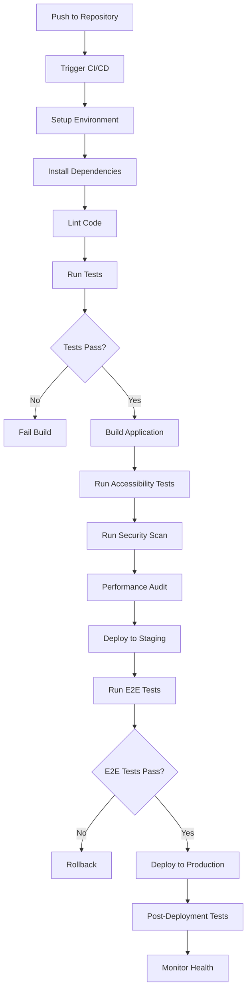

# Deployment Overview

This comprehensive guide covers deployment strategies, environments, and best practices for the Gunpla App, a Progressive Web Application built with React 19, Nx, and TypeScript.

##  Table of Contents

- [Deployment Architecture](#deployment-architecture)
- [Supported Platforms](#supported-platforms)
- [Deployment Strategies](#deployment-strategies)
- [Environment Configuration](#environment-configuration)
- [Build Process](#build-process)
- [CI/CD Pipeline](#cicd-pipeline)
- [Performance Optimization](#performance-optimization)
- [Monitoring and Analytics](#monitoring-and-analytics)

---

##  Deployment Architecture

### Application Architecture

The Gunpla App is a **client-side Progressive Web Application** with the following characteristics:



### Deployment Environments

#### 1. Development Environment
- **Purpose**: Local development and testing
- **URL**: `http://localhost:4200`
- **Features**: Hot reload, debugging, development tools
- **Data**: Local IndexedDB with sample data

#### 2. Staging Environment
- **Purpose**: Pre-production testing and validation
- **URL**: `https://staging.gunpla-app.com`
- **Features**: Production-like environment, testing data
- **Deployment**: Automated on every push to main branch

#### 3. Production Environment
- **Purpose**: Live application for end users
- **URL**: `https://gunpla-app.com`
- **Features**: Optimized performance, analytics, monitoring
- **Deployment**: Automated on tagged releases

#### 4. Preview Environments
- **Purpose**: Pull request previews and feature testing
- **URL**: `https://pr-123.gunpla-app.com`
- **Features**: Temporary deployments for testing
- **Deployment**: Automated on each pull request

---

## 🌐 Supported Platforms

### Static Hosting Platforms

#### Vercel (Recommended)
```bash
# Deploy to Vercel
npm run deploy:vercel

# Vercel configuration (vercel.json)
{
  "version": 2,
  "name": "gunpla-app",
  "builds": [
    {
      "src": "package.json",
      "use": "@vercel/static-build",
      "config": {
        "distDir": "dist/apps/gunpla-app"
      }
    }
  ],
  "routes": [
    {
      "src": "/(.*)",
      "dest": "/index.html"
    }
  ],
  "headers": [
    {
      "source": "/(.*)",
      "headers": [
        {
          "key": "X-Content-Type-Options",
          "value": "nosniff"
        },
        {
          "key": "X-Frame-Options",
          "value": "DENY"
        },
        {
          "key": "X-XSS-Protection",
          "value": "1; mode=block"
        }
      ]
    }
  ]
}
```

#### Netlify
```bash
# Deploy to Netlify
npm run deploy:netlify

# Netlify configuration (netlify.toml)
[build]
  base = "/"
  command = "npm run build"
  publish = "dist/apps/gunpla-app"

[[redirects]]
  from = "/*"
  to = "/index.html"
  status = 200

[build.environment]
  NODE_VERSION = "20"

[[headers]]
  for = "/*"
  [headers.values]
    X-Frame-Options = "DENY"
    X-XSS-Protection = "1; mode=block"
    X-Content-Type-Options = "nosniff"
```

#### GitHub Pages
```bash
# Deploy to GitHub Pages
npm run deploy:gh-pages

# GitHub Actions workflow for GitHub Pages
name: Deploy to GitHub Pages

on:
  push:
    branches: [ main ]
  pull_request:
    branches: [ main ]

jobs:
  build-and-deploy:
    runs-on: ubuntu-latest
    steps:
      - name: Checkout
        uses: actions/checkout@v3

      - name: Setup Node.js
        uses: actions/setup-node@v3
        with:
          node-version: '20'
          cache: 'npm'

      - name: Install dependencies
        run: npm ci

      - name: Build
        run: npm run build

      - name: Deploy to GitHub Pages
        uses: peaceiris/actions-gh-pages@v3
        if: github.ref == 'refs/heads/main'
        with:
          github_token: ${{ secrets.GITHUB_TOKEN }}
          publish_dir: ./dist/apps/gunpla-app
```

### Cloud Platforms

#### AWS S3 + CloudFront
```bash
# Deploy to AWS S3
npm run deploy:aws

# AWS deployment script
const AWS = require('aws-sdk');

const s3 = new AWS.S3({
  accessKeyId: process.env.AWS_ACCESS_KEY_ID,
  secretAccessKey: process.env.AWS_SECRET_ACCESS_KEY,
  region: process.env.AWS_REGION
});

const uploadToS3 = async (bucket, folder) => {
  const fs = require('fs');
  const path = require('path');

  const uploadDirectory = (dir, baseDir = folder) => {
    const files = fs.readdirSync(dir);

    files.forEach(file => {
      const filePath = path.join(dir, file);
      const stats = fs.statSync(filePath);

      if (stats.isDirectory()) {
        uploadDirectory(filePath, baseDir);
      } else {
        const content = fs.readFileSync(filePath);
        const key = path.relative(baseDir, filePath);

        s3.upload({
          Bucket: bucket,
          Key: key,
          Body: content,
          ContentType: getContentType(filePath),
          CacheControl: getCacheControl(filePath)
        }).promise();
      }
    });
  };

  uploadDirectory(folder);
};
```

#### Firebase Hosting
```bash
# Deploy to Firebase
npm run deploy:firebase

# Firebase configuration (firebase.json)
{
  "hosting": {
    "public": "dist/apps/gunpla-app",
    "ignore": [
      "firebase.json",
      "**/.*",
      "**/node_modules/**"
    ],
    "rewrites": [
      {
        "source": "**",
        "destination": "/index.html"
      }
    ],
    "headers": [
      {
        "source": "**/*.@(js|css)",
        "headers": [
          {
            "key": "Cache-Control",
            "value": "max-age=31536000"
          }
        ]
      }
    ]
  }
}
```

---

##  Deployment Strategies

### 1. Git-based Deployment (Recommended)

#### Automated Deployment Pipeline
```yaml
# GitHub Actions workflow
name: Deploy

on:
  push:
    branches: [ main ]
  pull_request:
    branches: [ main ]

jobs:
  test:
    runs-on: ubuntu-latest
    steps:
      - uses: actions/checkout@v3
      - name: Setup Node.js
        uses: actions/setup-node@v3
        with:
          node-version: '20'
          cache: 'npm'

      - name: Install dependencies
        run: npm ci

      - name: Run tests
        run: npm test

      - name: Run accessibility tests
        run: npm run test:a11y

      - name: Run E2E tests
        run: npm run test:e2e

  build:
    needs: test
    runs-on: ubuntu-latest
    steps:
      - uses: actions/checkout@v3
      - name: Setup Node.js
        uses: actions/setup-node@v3
        with:
          node-version: '20'
          cache: 'npm'

      - name: Install dependencies
        run: npm ci

      - name: Build
        run: npm run build

      - name: Analyze bundle
        run: npm run analyze

      - name: Upload build artifacts
        uses: actions/upload-artifact@v3
        with:
          name: build
          path: dist/apps/gunpla-app

  deploy-staging:
    needs: build
    runs-on: ubuntu-latest
    if: github.ref == 'refs/heads/main'
    steps:
      - name: Download build artifacts
        uses: actions/download-artifact@v3
        with:
          name: build

      - name: Deploy to staging
        run: npm run deploy:staging

  deploy-production:
    needs: deploy-staging
    runs-on: ubuntu-latest
    if: startsWith(github.ref, 'refs/tags/')
    steps:
      - name: Download build artifacts
        uses: actions/download-artifact@v3
        with:
          name: build

      - name: Deploy to production
        run: npm run deploy:prod
```

### 2. Blue-Green Deployment

#### Deployment Configuration
```typescript
// Blue-green deployment script
class BlueGreenDeployment {
  private environment: 'staging' | 'production'
  private currentColor: 'blue' | 'green' = 'blue'

  constructor(environment: 'staging' | 'production') {
    this.environment = environment
  }

  async deploy(): Promise<void> {
    const inactiveColor = this.currentColor === 'blue' ? 'green' : 'blue'

    try {
      // Deploy to inactive environment
      await this.deployToEnvironment(inactiveColor)

      // Run health checks
      await this.runHealthChecks(inactiveColor)

      // Run smoke tests
      await this.runSmokeTests(inactiveColor)

      // Switch traffic
      await this.switchTraffic(inactiveColor)

      // Update current color
      this.currentColor = inactiveColor

      console.log(`Successfully deployed to ${inactiveColor}`)
    } catch (error) {
      console.error('Deployment failed:', error)
      // Rollback if deployment fails
      await this.rollback()
      throw error
    }
  }

  private async deployToEnvironment(color: 'blue' | 'green'): Promise<void> {
    const url = `${color}.${this.environment}.gunpla-app.com`
    // Implementation for deploying to specific color environment
  }

  private async runHealthChecks(color: 'blue' | 'green'): Promise<void> {
    const url = `https://${color}.${this.environment}.gunpla-app.com`
    // Health check implementation
  }

  private async runSmokeTests(color: 'blue' | 'green'): Promise<void> {
    // Smoke test implementation
  }

  private async switchTraffic(color: 'blue' | 'green'): Promise<void> {
    // Traffic switching implementation
  }

  private async rollback(): Promise<void> {
    // Rollback implementation
  }
}
```

### 3. Canary Deployment

#### Gradual Rollout Strategy
```typescript
// Canary deployment configuration
interface CanaryConfig {
  stages: Array<{
    percentage: number
    duration: number // in minutes
    healthCheckThreshold: number
  }>
  rollbackConditions: string[]
}

const canaryConfig: CanaryConfig = {
  stages: [
    { percentage: 5, duration: 10, healthCheckThreshold: 99 },
    { percentage: 25, duration: 30, healthCheckThreshold: 98 },
    { percentage: 50, duration: 60, healthCheckThreshold: 97 },
    { percentage: 100, duration: 0, healthCheckThreshold: 95 }
  ],
  rollbackConditions: [
    'error_rate > 1%',
    'response_time_p95 > 2000ms',
    'health_check_failure_rate > 5%'
  ]
}

class CanaryDeployment {
  async executeCanary(config: CanaryConfig): Promise<void> {
    for (const stage of config.stages) {
      await this.rolloutToPercentage(stage.percentage)

      if (stage.duration > 0) {
        await this.waitAndMonitor(stage.duration, config.rollbackConditions)
      }
    }
  }

  private async rolloutToPercentage(percentage: number): Promise<void> {
    // Implementation for percentage-based rollout
  }

  private async waitAndMonitor(duration: number, rollbackConditions: string[]): Promise<void> {
    // Monitoring and rollback logic
  }
}
```

---

## ⚙️ Environment Configuration

### Environment Variables

#### Development Environment
```bash
# .env.development
NODE_ENV=development
VITE_APP_TITLE=Gunpla App (Development)
VITE_API_URL=http://localhost:4200/api
VITE_ENABLE_DEBUG=true
VITE_ENABLE_MOCK_API=true
VITE_LOG_LEVEL=debug
VITE_SENTRY_DSN=
VITE_ANALYTICS_ID=
```

#### Staging Environment
```bash
# .env.staging
NODE_ENV=staging
VITE_APP_TITLE=Gunpla App (Staging)
VITE_API_URL=https://staging-api.gunpla-app.com
VITE_ENABLE_DEBUG=false
VITE_ENABLE_MOCK_API=false
VITE_LOG_LEVEL=info
VITE_SENTRY_DSN=https://staging-sentry-dsn
VITE_ANALYTICS_ID=GA-STAGING-ID
```

#### Production Environment
```bash
# .env.production
NODE_ENV=production
VITE_APP_TITLE=Gunpla App
VITE_API_URL=https://api.gunpla-app.com
VITE_ENABLE_DEBUG=false
VITE_ENABLE_MOCK_API=false
VITE_LOG_LEVEL=error
VITE_SENTRY_DSN=https://production-sentry-dsn
VITE_ANALYTICS_ID=GA-PRODUCTION-ID
```

### Configuration Management

#### Environment-specific Configuration
```typescript
// src/config/environment.ts
export interface EnvironmentConfig {
  app: {
    name: string
    version: string
    title: string
    description: string
  }
  api: {
    baseUrl: string
    timeout: number
    retries: number
  }
  features: {
    debug: boolean
    mockApi: boolean
    analytics: boolean
    sentry: boolean
  }
  logging: {
    level: 'debug' | 'info' | 'warn' | 'error'
    console: boolean
    remote: boolean
  }
  pwa: {
    enabled: boolean
    offlineFirst: boolean
    backgroundSync: boolean
  }
}

const getConfig = (): EnvironmentConfig => {
  const env = import.meta.env.MODE || 'development'

  const configs: Record<string, EnvironmentConfig> = {
    development: {
      app: {
        name: 'gunpla-app',
        version: '1.0.0',
        title: 'Gunpla App (Development)',
        description: 'Development version of Gunpla App'
      },
      api: {
        baseUrl: 'http://localhost:4200/api',
        timeout: 10000,
        retries: 3
      },
      features: {
        debug: true,
        mockApi: true,
        analytics: false,
        sentry: false
      },
      logging: {
        level: 'debug',
        console: true,
        remote: false
      },
      pwa: {
        enabled: true,
        offlineFirst: true,
        backgroundSync: true
      }
    },
    staging: {
      app: {
        name: 'gunpla-app',
        version: '1.0.0',
        title: 'Gunpla App (Staging)',
        description: 'Staging version of Gunpla App'
      },
      api: {
        baseUrl: 'https://staging-api.gunpla-app.com',
        timeout: 5000,
        retries: 2
      },
      features: {
        debug: false,
        mockApi: false,
        analytics: true,
        sentry: true
      },
      logging: {
        level: 'info',
        console: true,
        remote: true
      },
      pwa: {
        enabled: true,
        offlineFirst: true,
        backgroundSync: true
      }
    },
    production: {
      app: {
        name: 'gunpla-app',
        version: '1.0.0',
        title: 'Gunpla App',
        description: 'Gundam model kit collection manager'
      },
      api: {
        baseUrl: 'https://api.gunpla-app.com',
        timeout: 5000,
        retries: 2
      },
      features: {
        debug: false,
        mockApi: false,
        analytics: true,
        sentry: true
      },
      logging: {
        level: 'error',
        console: false,
        remote: true
      },
      pwa: {
        enabled: true,
        offlineFirst: true,
        backgroundSync: true
      }
    }
  }

  return configs[env] || configs.development
}

export const config = getConfig()
```

---

## 🔨 Build Process

### Build Pipeline

#### Nx Build Configuration
```json
// project.json
{
  "name": "gunpla-app",
  "$schema": "../../node_modules/nx/schemas/project-schema.json",
  "sourceRoot": "apps/gunpla-app/src",
  "projectType": "application",
  "targets": {
    "build": {
      "executor": "@nx/vite:build",
      "outputs": ["{options.outputPath}"],
      "defaultConfiguration": "production",
      "options": {
        "outputPath": "dist/apps/gunpla-app"
      },
      "configurations": {
        "development": {
          "mode": "development",
          "sourceMap": true,
          "minify": false
        },
        "staging": {
          "mode": "production",
          "sourceMap": true,
          "minify": true
        },
        "production": {
          "mode": "production",
          "sourceMap": false,
          "minify": true
        }
      }
    },
    "serve": {
      "executor": "@nx/vite:dev-server",
      "defaultConfiguration": "development",
      "options": {
        "buildTarget": "gunpla-app:build"
      },
      "configurations": {
        "development": {
          "buildTarget": "gunpla-app:build:development"
        },
        "production": {
          "buildTarget": "gunpla-app:build:production"
        }
      }
    }
  }
}
```

#### Vite Configuration
```typescript
// vite.config.ts
import { defineConfig } from 'vite'
import react from '@vitejs/plugin-react'
import { nxViteTsPaths } from '@nx/vite/plugins/tsconfig-paths.plugin'

export default defineConfig({
  cacheDir: '../../node_modules/.vite/gunpla-app',

  plugins: [
    react(),
    nxViteTsPaths()
  ],

  build: {
    outDir: '../../dist/apps/gunpla-app',
    emptyOutDir: true,
    reportCompressedSize: true,
    commonjsOptions: {
      include: []
    },
    rollupOptions: {
      output: {
        manualChunks: {
          vendor: ['react', 'react-dom'],
          router: ['@tanstack/react-router'],
          ui: ['@mantine/core', '@mantine/hooks'],
          utils: ['dexie', 'date-fns']
        }
      }
    },
    chunkSizeWarningLimit: 1000
  },

  define: {
    __APP_VERSION__: JSON.stringify(process.env.npm_package_version)
  },

  server: {
    port: 4200,
    host: true
  }
})
```

### Bundle Optimization

#### Code Splitting Strategy
```typescript
// Code splitting configuration
const bundleAnalysis = {
  vendor: {
    react: ['react', 'react-dom'],
    router: ['@tanstack/react-router'],
    ui: ['@mantine/core', '@mantine/hooks', '@mantine/notifications'],
    utils: ['dexie', 'date-fns', 'lodash-es', 'uuid']
  },
  features: {
    collection: ['../features/collection'],
    search: ['../features/search'],
    settings: ['../features/settings'],
    photos: ['../features/photos']
  },
  routes: {
    // Route-based code splitting handled by TanStack Router
  }
}
```

#### Asset Optimization
```typescript
// Asset optimization configuration
export const assetOptimization = {
  images: {
    formats: ['webp', 'avif', 'jpg'],
    sizes: [320, 640, 960, 1280, 1920],
    quality: 80,
    placeholder: 'blur'
  },
  fonts: {
    preload: ['inter-var.woff2'],
    display: 'swap',
    fallback: 'system-ui'
  },
  icons: {
    format: 'svg',
    optimize: true
  }
}
```

---

## 🔄 CI/CD Pipeline

### Pipeline Architecture



### Quality Gates

#### Automated Testing Pipeline
```yaml
# Quality gates configuration
quality_gates:
  code_coverage:
    minimum: 80
    threshold: 80

  accessibility:
    wcag_level: AA
    violations_threshold: 0

  performance:
    lighthouse_score: 90
    bundle_size: 5000000  # 5MB max

  security:
    vulnerabilities: 0
    high_severity: 0

  eslint:
    errors: 0
    warnings_threshold: 10
```

#### Deployment Validation
```typescript
// Deployment validation script
class DeploymentValidator {
  async validate(): Promise<ValidationResult> {
    const results = await Promise.all([
      this.validatePerformance(),
      this.validateAccessibility(),
      this.validateSecurity(),
      this.validateFunctionality()
    ])

    return {
      passed: results.every(r => r.passed),
      results
    }
  }

  private async validatePerformance(): Promise<TestResult> {
    // Performance validation
  }

  private async validateAccessibility(): Promise<TestResult> {
    // Accessibility validation
  }

  private async validateSecurity(): Promise<TestResult> {
    // Security validation
  }

  private async validateFunctionality(): Promise<TestResult> {
    // Functionality validation
  }
}
```

---

## 📊 Performance Optimization

### Build Optimizations

#### Bundle Analysis
```bash
# Analyze bundle size
npm run build:analyze

# Bundle analyzer configuration
const bundleAnalyzerConfig = {
  analyzerMode: 'static',
  reportFilename: 'bundle-analysis.html',
  openAnalyzer: false,
  generateStatsFile: true,
  statsFilename: 'bundle-stats.json'
}
```

#### Compression and Caching
```typescript
// Compression and caching headers
const performanceHeaders = {
  // Static assets
  '/assets/*': {
    'Cache-Control': 'public, max-age=31536000, immutable',
    'Content-Encoding': 'gzip'
  },

  // HTML files
  '/*.html': {
    'Cache-Control': 'public, max-age=3600',
    'Content-Encoding': 'gzip'
  },

  // API responses
  '/api/*': {
    'Cache-Control': 'public, max-age=300',
    'Content-Encoding': 'gzip'
  }
}
```

### Runtime Optimizations

#### Service Worker Caching
```typescript
// Performance-optimized service worker
self.addEventListener('fetch', (event) => {
  const { request } = event
  const url = new URL(request.url)

  // Cache-first for static assets
  if (isStaticAsset(url)) {
    event.respondWith(cacheFirst(request))
    return
  }

  // Network-first for dynamic content
  if (isDynamicContent(url)) {
    event.respondWith(networkFirst(request))
    return
  }

  // Stale-while-revalidate for API calls
  if (isApiCall(url)) {
    event.respondWith(staleWhileRevalidate(request))
    return
  }

  // Default behavior
  event.respondWith(fetch(request))
})
```

#### Image Optimization
```typescript
// Image optimization service
class ImageOptimizer {
  static optimizeImage(file: File): Promise<OptimizedImage> {
    return new Promise((resolve) => {
      const img = new Image()
      const canvas = document.createElement('canvas')
      const ctx = canvas.getContext('2d')!

      img.onload = () => {
        // Calculate optimal dimensions
        const dimensions = calculateOptimalDimensions(img.width, img.height)

        canvas.width = dimensions.width
        canvas.height = dimensions.height

        // Draw and compress
        ctx.drawImage(img, 0, 0, dimensions.width, dimensions.height)

        canvas.toBlob(
          (blob) => {
            resolve({
              blob: blob!,
              dimensions,
              originalSize: file.size,
              optimizedSize: blob!.size
            })
          },
          'image/webp',
          0.8
        )
      }

      img.src = URL.createObjectURL(file)
    })
  }
}
```

---

## 📈 Monitoring and Analytics

### Performance Monitoring

#### Core Web Vitals
```typescript
// Core Web Vitals monitoring
import { getCLS, getFID, getFCP, getLCP, getTTFB } from 'web-vitals'

function sendToAnalytics(metric: any) {
  // Send to analytics service
  gtag('event', metric.name, {
    value: Math.round(metric.name === 'CLS' ? metric.value * 1000 : metric.value),
    event_category: 'Web Vitals',
    event_label: metric.id,
    non_interaction: true,
    custom_parameter_1: window.location.pathname
  })
}

getCLS(sendToAnalytics)
getFID(sendToAnalytics)
getFCP(sendToAnalytics)
getLCP(sendToAnalytics)
getTTFB(sendToAnalytics)
```

#### Error Monitoring
```typescript
// Error monitoring with Sentry
import * as Sentry from '@sentry/react'

Sentry.init({
  dsn: process.env.SENTRY_DSN,
  environment: process.env.NODE_ENV,
  tracesSampleRate: 1.0,
  integrations: [
    new Sentry.BrowserTracing(),
    new Sentry.Replay()
  ],
  beforeSend(event) {
    // Filter out certain errors
    if (event.exception?.values?.[0]?.type === 'ChunkLoadError') {
      return null
    }
    return event
  }
})
```

### User Analytics

#### Custom Analytics Events
```typescript
// Custom analytics tracking
export class AnalyticsService {
  static trackKitCreation(kit: GunplaKit) {
    gtag('event', 'kit_created', {
      event_category: 'collection_management',
      event_label: kit.grade,
      custom_parameter_1: kit.manufacturer,
      custom_parameter_2: kit.scale
    })
  }

  static trackSearch(query: string, resultCount: number) {
    gtag('event', 'search_performed', {
      event_category: 'search',
      custom_parameter_1: query.length,
      custom_parameter_2: resultCount
    })
  }

  static trackPWAInstall() {
    gtag('event', 'pwa_installed', {
      event_category: 'pwa',
      custom_parameter_1: navigator.platform
    })
  }

  static trackOfflineUsage(duration: number) {
    gtag('event', 'offline_session', {
      event_category: 'offline',
      custom_parameter_1: duration
    })
  }
}
```

### Health Monitoring

#### Health Check Endpoint
```typescript
// Health check service
class HealthCheckService {
  static async runHealthChecks(): Promise<HealthCheckResult> {
    const checks = await Promise.allSettled([
      this.checkDatabase(),
      this.checkCache(),
      this.checkServiceWorker(),
      this.checkConnectivity()
    ])

    return {
      status: checks.every(check => check.status === 'fulfilled') ? 'healthy' : 'unhealthy',
      checks: checks.map((check, index) => ({
        name: ['database', 'cache', 'serviceWorker', 'connectivity'][index],
        status: check.status,
        value: check.status === 'fulfilled' ? check.value : null,
        error: check.status === 'rejected' ? check.reason : null
      })),
      timestamp: new Date().toISOString()
    }
  }

  private static async checkDatabase(): Promise<boolean> {
    try {
      // Check IndexedDB connectivity
      return await db.open().then(() => true)
    } catch {
      return false
    }
  }

  private static async checkCache(): Promise<boolean> {
    try {
      const cache = await caches.open('gunpla-health-check')
      return true
    } catch {
      return false
    }
  }

  private static async checkServiceWorker(): Promise<boolean> {
    return 'serviceWorker' in navigator
  }

  private static async checkConnectivity(): Promise<boolean> {
    return navigator.onLine
  }
}
```

---

##  Deployment Best Practices

### Pre-Deployment Checklist

#### Code Quality
- [ ] All tests passing (unit, integration, E2E)
- [ ] Code coverage meets minimum threshold (80%+)
- [ ] No TypeScript errors
- [ ] ESLint passes with no errors
- [ ] Security scan passes with no vulnerabilities

#### Performance
- [ ] Bundle size within limits (< 5MB)
- [ ] Lighthouse score ≥ 90
- [ ] Core Web Vitals meet thresholds
- [ ] Images optimized and compressed
- [ ] Service worker properly configured

#### Accessibility
- [ ] WCAG 2.1 AA compliance verified
- [ ] All images have alt text
- [ ] Keyboard navigation works
- [ ] Screen reader compatibility confirmed
- [ ] Color contrast ratios meet standards

#### Security
- [ ] No hardcoded secrets
- [ ] Security headers configured
- [ ] Content Security Policy implemented
- [ ] HTTPS enforced
- [ ] Dependencies scanned for vulnerabilities

### Post-Deployment Monitoring

#### Key Metrics to Monitor
- **Performance**: Core Web Vitals, page load times, bundle sizes
- **Errors**: JavaScript errors, API failures, service worker errors
- **Usage**: Active users, feature adoption, session duration
- **Accessibility**: A11y violations, screen reader usage
- **PWA**: Installation rates, offline usage, background sync success

#### Alert Configuration
```typescript
// Alert thresholds
const alertThresholds = {
  performance: {
    lighthouse_score: 85,
    page_load_time: 3000,
    error_rate: 0.01
  },
  usage: {
    active_users_drop: 0.2,  // 20% drop
    session_duration: 30     // seconds
  },
  errors: {
    javascript_errors: 10,   // per minute
    api_failures: 0.05       // 5% failure rate
  }
}
```

---

## 🔗 Related Documentation

- [Environment Configuration](./environment-config.md) - Detailed environment setup
- [CI/CD Pipeline](./ci-cd-pipeline.md) - Continuous integration and deployment
- [Monitoring Guide](./monitoring.md) - Performance and error monitoring
- [Security Practices](../security/README.md) - Security best practices

---

**Last Updated**: 2025-12-04
**Version**: 1.0.0