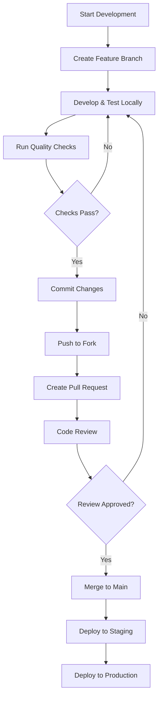

# Development Workflow

This guide outlines the complete development workflow for contributing to the Gunpla App, from setting up your environment to deploying changes.

## 🔄 Development Cycle Overview



## 🌳 Branch Strategy

We use a simplified Git flow with clear branch naming conventions:

### Main Branches

- **`main`**: Production-ready code (always deployable)
- **`develop`**: Integration branch for features (if needed for larger teams)

### Feature Branches

Format: `feature/description` or `feature/TICKET-number-description`

```bash
# Examples
feature/user-authentication
feature/GPA-123-add-kit-management
feature/pwa-installation
bugfix/GPA-456-fix-image-upload
hotfix/GPA-789-critical-security-patch
```

### Branch Lifecycle

1. **Create**: Branch from `main` for new features
2. **Develop**: Work on feature with regular commits
3. **Test**: Ensure all tests pass and quality checks succeed
4. **Review**: Submit PR for code review
5. **Merge**: Merge to `main` after approval
6. **Cleanup**: Delete feature branch after merge

## 📝 Commit Guidelines

### Commit Message Format

We follow [Conventional Commits](https://www.conventionalcommits.org/) specification:

```
<type>[optional scope]: <description>

[optional body]

[optional footer(s)]
```

### Types

- `feat`: New feature
- `fix`: Bug fix
- `docs`: Documentation changes
- `style`: Code formatting (no functional change)
- `refactor`: Code refactoring
- `perf`: Performance improvements
- `test`: Test additions or changes
- `build`: Build system changes
- `ci`: CI/CD changes
- `chore`: Maintenance tasks

### Examples

```bash
# Good commit messages
feat(collection): add kit filtering by grade
fix(pwa): resolve offline storage issue
docs(readme): update installation instructions
test(units): add coverage for kit service
refactor(storage): optimize indexedb queries

# Bad commit messages
added stuff
fixed bug
update
wip
```

### Commit Body

For significant changes, include details about:

- **What** was changed and why
- **How** the change was implemented
- **Breaking changes** (if any)
- **Related issues** (using GitHub keywords)

```bash
feat(auth): implement user authentication

Add JWT-based authentication system with secure token storage.
Includes login form, password reset, and session management.

Closes #123
BREAKING CHANGE: Removed anonymous user access
```

##  Daily Development Workflow

### 1. Start Your Day

```bash
# Switch to main and pull latest changes
git checkout main
git pull upstream main

# Create or update your feature branch
git checkout feature/your-feature-name
git rebase main
```

### 2. Development Session

```bash
# Start development server
npm run dev

# Run tests in watch mode (separate terminal)
npm run test:watch

# Check linting on save (IDE integration)
# ESLint and Prettier should run automatically
```

### 3. Making Changes

```bash
# Stage your changes
git add .

# Commit with proper message
git commit -m "feat(feature): implement new functionality"

# Push regularly to backup your work
git push origin feature/your-feature-name
```

### 4. Quality Assurance

```bash
# Run full test suite
npm test

# Check code quality
npm run lint
npm run type-check

# Build to ensure no production errors
npm run build

# Run accessibility tests
npm run test:a11y

# Run E2E tests
npm run test:e2e
```

##  Testing Workflow

### Test-Driven Development (TDD)

We encourage TDD for new features:

1. **Write failing tests** first
2. **Implement minimal code** to make tests pass
3. **Refactor** while keeping tests green
4. **Repeat** for additional functionality

### Test Types

#### Unit Tests
- File location: `**/*.test.ts` or `**/*.spec.ts`
- Framework: Vitest
- Coverage goal: 80%+

```bash
# Run unit tests
npm run test:unit

# Run with coverage
npm run test:unit:coverage
```

#### Integration Tests
- File location: `**/*.integration.test.ts`
- Framework: Vitest
- Test component interactions

```bash
# Run integration tests
npm run test:integration
```

#### E2E Tests
- File location: `e2e/**/*.spec.ts`
- Framework: Playwright
- Test user workflows

```bash
# Run E2E tests
npm run test:e2e

# Run in headed mode (show browser)
npm run test:e2e:headed
```

### Test Organization

```
apps/gunpla-app/src/
├── components/
│   ├── KitCard/
│   │   ├── KitCard.tsx
│   │   ├── KitCard.test.tsx
│   │   └── index.ts
│   └── ...
├── features/
│   ├── collection/
│   │   ├── components/
│   │   ├── hooks/
│   │   ├── services/
│   │   └── __tests__/
│   │       ├── collection.test.ts
│   │       └── collection.integration.test.ts
│   └── ...
└── ...
```

## 🔍 Code Review Process

### Pull Request Template

```markdown
## Description
Brief description of changes and their purpose.

## Type of Change
- [ ] Bug fix
- [ ] New feature
- [ ] Breaking change
- [ ] Documentation update

## Testing
- [ ] Unit tests pass
- [ ] Integration tests pass
- [ ] E2E tests pass
- [ ] Manual testing completed

## Checklist
- [ ] Code follows style guidelines
- [ ] Self-review completed
- [ ] Documentation updated
- [ ] Accessibility considered
- [ ] Performance considered

## Screenshots (if applicable)
Add screenshots for UI changes.

## Related Issues
Closes #ISSUE_NUMBER
```

### Review Guidelines

#### For Reviewers

1. **Check Functionality**: Does the code work as intended?
2. **Code Quality**: Is it clean, readable, and maintainable?
3. **Testing**: Are tests comprehensive and meaningful?
4. **Performance**: Any performance implications?
5. **Accessibility**: Is it accessible to all users?
6. **Security**: Any security concerns?

#### For Authors

1. **Self-Review**: Review your own code first
2. **Clear Description**: Explain the "why" not just "what"
3. **Small PRs**: Keep pull requests focused and manageable
4. **Responsive**: Address feedback promptly
5. **Testing**: Ensure comprehensive test coverage

### Review Etiquette

- **Be constructive**: Focus on improvement, not criticism
- **Explain reasoning**: Help authors understand your perspective
- **Be respectful**: Maintain professional communication
- **Timely response**: Aim to review within 24 hours

##  Development Commands Reference

### Nx Commands

```bash
# Generate new components
nx g @nx/react:component my-component --project=gunpla-app

# Generate new library
nx g @nx/js:lib shared-utils

# Serve application
nx serve gunpla-app

# Build application
nx build gunpla-app

# Test application
nx test gunpla-app

# Lint application
nx lint gunpla-app

# Graph dependencies
nx graph
```

### Custom Scripts

```bash
# Development
npm run dev              # Start dev server
npm run dev:https        # Start with HTTPS
npm run dev:mock         # Start with mock data

# Building
npm run build            # Production build
npm run build:analyze    # Build with bundle analysis
npm run build:stats      # Generate build stats

# Testing
npm test                 # All tests
npm run test:unit        # Unit tests only
npm run test:integration # Integration tests only
npm run test:e2e         # E2E tests only
npm run test:coverage    # Tests with coverage
npm run test:watch       # Tests in watch mode

# Quality
npm run lint             # ESLint check
npm run lint:fix         # Auto-fix ESLint issues
npm run format           # Prettier formatting
npm run type-check       # TypeScript checking
npm run a11y             # Accessibility tests

# Database
npm run db:reset         # Reset local database
npm run db:seed          # Seed with sample data
npm run db:export        # Export data
npm run db:import        # Import data

# PWA
npm run pwa:build        # Build PWA assets
npm run pwa:test         # Test PWA functionality
npm run pwa:manifest     # Generate manifest
```

##  Mobile Development Workflow

### Responsive Testing

```bash
# Test different screen sizes
npm run dev -- --device=mobile
npm run dev -- --device=tablet
npm run dev -- --device=desktop
```

### PWA Testing

```bash
# Test PWA features
npm run pwa:test

# Build PWA for testing
npm run build && npm run pwa:serve

# Test service worker
npm run pwa:sw:test
```

### Cross-Browser Testing

```bash
# Install different browsers for testing
npm run test:browsers:chrome
npm run test:browsers:firefox
npm run test:browsers:safari
npm run test:browsers:edge
```

## 🔧 Debugging Workflow

### Common Debugging Techniques

1. **Console Logging**: Use `console.log` strategically
2. **Browser DevTools**: Use breakpoints and debugger
3. **React DevTools**: Inspect component state and props
4. **Network Tab**: Monitor API calls and resource loading
5. **Performance Tab**: Identify performance bottlenecks

### Debugging Commands

```bash
# Start with debugging enabled
npm run dev:debug

# Run tests in debug mode
npm run test:debug

# Generate source maps for debugging
npm run build:debug
```

### Common Issues and Solutions

#### Build Issues
```bash
# Clear build cache
rm -rf .nx/cache dist node_modules/.cache

# Reinstall dependencies
npm ci

# Check for TypeScript errors
npx tsc --noEmit
```

#### Test Issues
```bash
# Run tests with verbose output
npm test -- --verbose

# Run specific test file
npm test -- KitCard.test.tsx

# Debug specific test
npm test -- --debug KitCard.test.tsx
```

## 📊 Performance Workflow

### Performance Monitoring

```bash
# Analyze bundle size
npm run analyze

# Run Lighthouse audit
npm run lighthouse

# Performance budgets check
npm run perf:budget

# Monitor in development
npm run dev:profile
```

### Performance Optimization

1. **Code Splitting**: Lazy load components and routes
2. **Bundle Optimization**: Remove unused dependencies
3. **Image Optimization**: Compress and resize images
4. **Caching**: Implement effective caching strategies
5. **Monitoring**: Track Core Web Vitals

##  Deployment Workflow

### Pre-Deployment Checklist

- [ ] All tests pass
- [ ] Code reviewed and approved
- [ ] Documentation updated
- [ ] Accessibility audit passed
- [ ] Security scan completed
- [ ] Performance budget met
- [ ] PWA functionality verified

### Deployment Process

```bash
# Build for production
npm run build

# Run final tests
npm run test:prod

# Deploy to staging
npm run deploy:staging

# Run E2E tests on staging
npm run test:e2e:staging

# Deploy to production
npm run deploy:prod

# Post-deployment verification
npm run verify:deploy
```

## 🔐 Security Workflow

### Security Checklist

- [ ] No hardcoded secrets
- [ ] Dependencies scanned for vulnerabilities
- [ ] CSP headers configured
- [ ] HTTPS enforced
- [ ] Input validation implemented
- [ ] XSS protection enabled
- [ ] Authentication tested

### Security Commands

```bash
# Scan for vulnerabilities
npm audit

# Fix vulnerabilities
npm audit fix

# Security audit
npm run security:audit

# Check for secrets
npx git-secrets --scan
```

##  Best Practices

### Code Organization

- Use feature-based architecture
- Keep components small and focused
- Follow naming conventions
- Document complex logic
- Use TypeScript strictly

### Git Best Practices

- Commit early and often
- Write meaningful commit messages
- Keep PRs small and focused
- Use branches for all work
- Review your own code first

### Testing Best Practices

- Test behavior, not implementation
- Use descriptive test names
- Test edge cases
- Keep tests maintainable
- Use fixtures for complex data

### Performance Best Practices

- Monitor bundle size
- Optimize images
- Use lazy loading
- Implement caching
- Measure before optimizing

##  Collaboration Guidelines

### Communication

- Use clear and concise language
- Provide context for changes
- Ask questions when unsure
- Share knowledge openly
- Give constructive feedback

### Conflict Resolution

1. **Discuss**: Communicate directly when possible
2. **Escalate**: Involve team lead if needed
3. **Document**: Record decisions and rationale
4. **Learn**: Use conflicts as learning opportunities

## 📚 Additional Resources

- [Nx Documentation](https://nx.dev/)
- [React Documentation](https://react.dev/)
- [TypeScript Handbook](https://www.typescriptlang.org/docs/)
- [MDN Web Docs](https://developer.mozilla.org/)
- [Web.dev](https://web.dev/)

---

**Need help?** Reach out to the team or check our [troubleshooting guide](../troubleshooting/common-issues.md).

**Happy coding!** 🎉

---

**Last Updated**: 2025-12-04
**Version**: 1.0.0