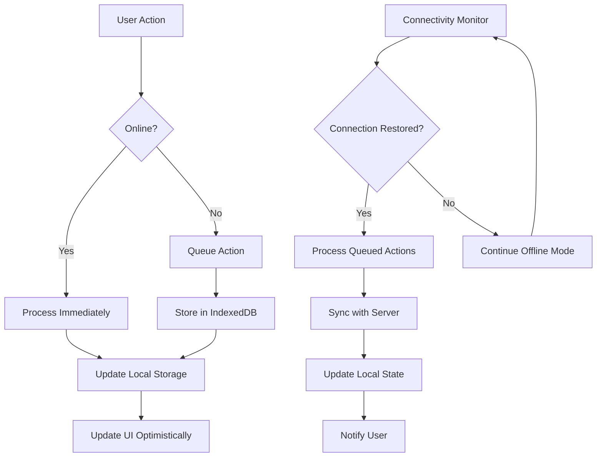

# Offline Support

This document details the offline-first architecture and functionality of the Gunpla App, including data synchronization, caching strategies, and offline user experience.

##  Overview

The Gunpla App is designed as an **offline-first Progressive Web Application** that provides full functionality without requiring an internet connection. All user data is stored locally using IndexedDB, with synchronization capabilities when connectivity is restored.

### Key Offline Features

- **Complete Offline Operation**: All core features work without internet
- **Local Data Storage**: IndexedDB for persistent data storage
- **Intelligent Caching**: Strategic resource caching for performance
- **Background Sync**: Queue actions while offline, sync when online
- **Offline Detection**: Real-time connectivity status awareness
- **Graceful Degradation**: Progressive enhancement for network-dependent features

---

##  Offline Architecture

### Data Flow Architecture



### Storage Hierarchy

```
Storage Layers:
┌─────────────────────────────────────────────────────────────┐
│                    Application State                         │
│                  (React State, Stores)                       │
├─────────────────────────────────────────────────────────────┤
│                    Session Storage                           │
│              (Temporary UI State, Forms)                      │
├─────────────────────────────────────────────────────────────┤
│                    IndexedDB                                 │
│         (Persistent User Data: Kits, Photos, Settings)       │
├─────────────────────────────────────────────────────────────┤
│                    Local Storage                             │
│           (Preferences, Cache, Configuration)                │
├─────────────────────────────────────────────────────────────┤
│                    Cache Storage                             │
│        (Static Assets, Images, API Responses)                │
└─────────────────────────────────────────────────────────────┘
```

---

## 💾 Local Data Storage

### IndexedDB Schema

**Location**: `apps/gunpla-app/src/lib/database/schema.ts`

```typescript
// Main database schema for offline storage
export class GunplaDatabase extends Dexie {
  kits!: Table<GunplaKit>
  categories!: Table<Category>
  photos!: Table<Photo>
  buildLogs!: Table<BuildLog>
  settings!: Table<AppSettings>
  queuedActions!: Table<QueuedAction>
  syncMetadata!: Table<SyncMetadata>

  constructor() {
    super('GunplaAppDB')

    // Define database schema with versioning
    this.version(1).stores({
      kits: '++id, name, grade, series, scale, manufacturer, buildStatus, tags, categoryId, createdAt, updatedAt',
      categories: '++id, name, parentId, level, path, sortOrder, isActive, createdAt, updatedAt',
      photos: '++id, kitId, filename, type, url, thumbnailUrl, dimensions, createdAt, updatedAt',
      buildLogs: '++id, kitId, date, description, photos, createdAt, updatedAt',
      settings: 'key, value, updatedAt',
      queuedActions: '++id, type, entity, data, timestamp, retryCount',
      syncMetadata: 'id, lastSync, version, checksum'
    })

    // Database version 2 - added indexes and migrations
    this.version(2).stores({
      kits: '++id, name, grade, series, scale, manufacturer, buildStatus, tags, categoryId, createdAt, updatedAt, [grade+scale], [series+grade], buildStatus',
      categories: '++id, name, parentId, level, path, sortOrder, isActive, createdAt, updatedAt, parentId',
      photos: '++id, kitId, filename, type, url, thumbnailUrl, dimensions, createdAt, updatedAt, kitId, type',
      buildLogs: '++id, kitId, date, description, photos, createdAt, updatedAt, kitId, date',
      settings: 'key, value, updatedAt',
      queuedActions: '++id, type, entity, data, timestamp, retryCount, [type+entity]',
      syncMetadata: 'id, lastSync, version, checksum'
    }).upgrade(tx => {
      // Migration logic for version 2
      return tx.table('kits').toCollection().modify(kit => {
        // Add compound indexes
        kit.searchIndex = `${kit.name} ${kit.series} ${kit.grade}`.toLowerCase()
      })
    })
  }
}

// Database instance
export const db = new GunplaDatabase()
```

### Data Access Layer

**Location**: `apps/gunpla-app/src/lib/database/services/StorageService.ts`

```typescript
export class StorageService {
  private db: GunplaDatabase

  constructor() {
    this.db = db
  }

  // Kit operations with offline support
  async createKit(kit: Omit<GunplaKit, 'id' | 'createdAt' | 'updatedAt'>): Promise<GunplaKit> {
    const now = new Date()
    const newKit: GunplaKit = {
      ...kit,
      id: generateId(),
      createdAt: now,
      updatedAt: now
    }

    // Store in IndexedDB
    await this.db.kits.add(newKit)

    // Queue for sync if online
    if (navigator.onLine) {
      await this.queueAction({
        type: 'create',
        entity: 'kit',
        data: newKit
      })
    }

    return newKit
  }

  async updateKit(id: string, updates: Partial<GunplaKit>): Promise<GunplaKit> {
    const existingKit = await this.db.kits.get(id)
    if (!existingKit) {
      throw new Error('Kit not found')
    }

    const updatedKit: GunplaKit = {
      ...existingKit,
      ...updates,
      updatedAt: new Date()
    }

    // Update in IndexedDB
    await this.db.kits.update(id, updatedKit)

    // Queue for sync if online
    if (navigator.onLine) {
      await this.queueAction({
        type: 'update',
        entity: 'kit',
        data: { id, updates }
      })
    }

    return updatedKit
  }

  async deleteKit(id: string): Promise<void> {
    // Check if kit exists
    const kit = await this.db.kits.get(id)
    if (!kit) {
      throw new Error('Kit not found')
    }

    // Delete from IndexedDB
    await this.db.kits.delete(id)

    // Delete related photos
    const photos = await this.db.photos.where('kitId').equals(id).toArray()
    await this.db.photos.bulkDelete(photos.map(photo => photo.id))

    // Queue for sync if online
    if (navigator.onLine) {
      await this.queueAction({
        type: 'delete',
        entity: 'kit',
        data: { id }
      })
    }
  }

  // Query operations with offline support
  async getKits(filter?: KitFilters): Promise<GunplaKit[]> {
    let query = this.db.kits.toCollection()

    if (filter) {
      if (filter.grades?.length) {
        query = query.filter(kit => filter.grades!.includes(kit.grade))
      }
      if (filter.manufacturers?.length) {
        query = query.filter(kit => filter.manufacturers!.includes(kit.manufacturer))
      }
      if (filter.buildStatuses?.length) {
        query = query.filter(kit => filter.buildStatuses!.includes(kit.buildStatus))
      }
      if (filter.categoryId) {
        query = query.filter(kit => kit.categoryId === filter.categoryId)
      }
      if (filter.isFavorite !== undefined) {
        query = query.filter(kit => kit.isFavorite === filter.isFavorite)
      }
    }

    return await query.toArray()
  }

  // Search functionality
  async searchKits(query: string): Promise<GunplaKit[]> {
    const searchTerm = query.toLowerCase()

    return await this.db.kits
      .filter(kit =>
        kit.name.toLowerCase().includes(searchTerm) ||
        kit.series.name.toLowerCase().includes(searchTerm) ||
        kit.modelNumber?.toLowerCase().includes(searchTerm) ||
        kit.tags.some(tag => tag.toLowerCase().includes(searchTerm))
      )
      .toArray()
  }

  // Bulk operations
  async bulkCreateKits(kits: Omit<GunplaKit, 'id' | 'createdAt' | 'updatedAt'>[]): Promise<GunplaKit[]> {
    const now = new Date()
    const newKits = kits.map(kit => ({
      ...kit,
      id: generateId(),
      createdAt: now,
      updatedAt: now
    }))

    await this.db.kits.bulkAdd(newKits)

    // Queue each for sync
    if (navigator.onLine) {
      for (const kit of newKits) {
        await this.queueAction({
          type: 'create',
          entity: 'kit',
          data: kit
        })
      }
    }

    return newKits
  }
}
```

---

## 🔄 Background Synchronization

### Action Queue Management

**Location**: `apps/gunpla-app/src/lib/sync/ActionQueue.ts`

```typescript
export interface QueuedAction {
  id: number
  type: 'create' | 'update' | 'delete'
  entity: 'kit' | 'photo' | 'category' | 'buildLog'
  data: unknown
  timestamp: number
  retryCount: number
  lastRetry?: number
  status: 'pending' | 'processing' | 'failed' | 'completed'
  error?: string
}

export class ActionQueue {
  private db: Dexie
  private processing = false

  constructor() {
    this.db = db
  }

  async queueAction(action: Omit<QueuedAction, 'id' | 'timestamp' | 'retryCount' | 'status'>): Promise<void> {
    const queuedAction: Omit<QueuedAction, 'id'> = {
      ...action,
      timestamp: Date.now(),
      retryCount: 0,
      status: 'pending'
    }

    await this.db.queuedActions.add(queuedAction)

    // Trigger sync if online
    if (navigator.onLine) {
      await this.processQueue()
    }
  }

  async processQueue(): Promise<void> {
    if (this.processing) {
      return
    }

    this.processing = true

    try {
      const actions = await this.db.queuedActions
        .where('status')
        .equals('pending')
        .or('status')
        .equals('failed')
        .toArray()

      for (const action of actions) {
        await this.processAction(action)
      }
    } finally {
      this.processing = false
    }
  }

  private async processAction(action: QueuedAction): Promise<void> {
    try {
      // Mark as processing
      await this.db.queuedActions.update(action.id, {
        status: 'processing',
        lastRetry: Date.now()
      })

      // Process based on entity and type
      switch (action.entity) {
        case 'kit':
          await this.processKitAction(action)
          break
        case 'photo':
          await this.processPhotoAction(action)
          break
        case 'category':
          await this.processCategoryAction(action)
          break
        case 'buildLog':
          await this.processBuildLogAction(action)
          break
      }

      // Mark as completed
      await this.db.queuedActions.update(action.id, {
        status: 'completed'
      })

    } catch (error) {
      console.error('Failed to process action:', action, error)

      // Increment retry count
      const retryCount = action.retryCount + 1
      const maxRetries = 3

      if (retryCount >= maxRetries) {
        // Mark as failed permanently
        await this.db.queuedActions.update(action.id, {
          status: 'failed',
          retryCount,
          error: error instanceof Error ? error.message : 'Unknown error'
        })
      } else {
        // Mark as pending for retry
        await this.db.queuedActions.update(action.id, {
          status: 'pending',
          retryCount
        })

        // Schedule retry with exponential backoff
        const delay = Math.min(1000 * Math.pow(2, retryCount), 30000)
        setTimeout(() => this.processAction(action), delay)
      }
    }
  }

  private async processKitAction(action: QueuedAction): Promise<void> {
    const data = action.data as any

    switch (action.type) {
      case 'create':
        // Sync to server (if applicable)
        await this.syncKitToServer(data)
        break
      case 'update':
        await this.syncKitUpdateToServer(data.id, data.updates)
        break
      case 'delete':
        await this.syncKitDeletionToServer(data.id)
        break
    }
  }

  // Similar methods for other entity types...
}

// Sync utilities
class SyncUtilities {
  static async syncKitToServer(kit: GunplaKit): Promise<void> {
    // Implementation for server sync
    // This would make API calls to sync data
    console.log('Syncing kit to server:', kit.id)
  }

  static async syncKitUpdateToServer(id: string, updates: Partial<GunplaKit>): Promise<void> {
    console.log('Syncing kit update to server:', id, updates)
  }

  static async syncKitDeletionToServer(id: string): Promise<void> {
    console.log('Syncing kit deletion to server:', id)
  }
}
```

### Connectivity Monitoring

**Location**: `apps/gunpla-app/src/hooks/useConnectivity.ts`

```typescript
export function useConnectivity() {
  const [isOnline, setIsOnline] = useState(navigator.onLine)
  const [connectionType, setConnectionType] = useState<ConnectionType>('unknown')
  const [syncStatus, setSyncStatus] = useState<'idle' | 'syncing' | 'error'>('idle')

  useEffect(() => {
    const handleOnline = () => {
      setIsOnline(true)
      setSyncStatus('syncing')

      // Trigger sync when coming back online
      triggerSync().finally(() => {
        setSyncStatus('idle')
      })
    }

    const handleOffline = () => {
      setIsOnline(false)
      setSyncStatus('idle')
    }

    const handleConnectionChange = () => {
      if ('connection' in navigator) {
        const connection = (navigator as any).connection
        setConnectionType(connection?.effectiveType || 'unknown')
      }
    }

    window.addEventListener('online', handleOnline)
    window.addEventListener('offline', handleOffline)

    if ('connection' in navigator) {
      const connection = (navigator as any).connection
      connection.addEventListener('change', handleConnectionChange)
      setConnectionType(connection?.effectiveType || 'unknown')
    }

    return () => {
      window.removeEventListener('online', handleOnline)
      window.removeEventListener('offline', handleOffline)

      if ('connection' in navigator) {
        const connection = (navigator as any).connection
        connection.removeEventListener('change', handleConnectionChange)
      }
    }
  }, [])

  const triggerSync = async () => {
    try {
      const actionQueue = new ActionQueue()
      await actionQueue.processQueue()

      // Update sync metadata
      await updateSyncMetadata()
    } catch (error) {
      setSyncStatus('error')
      throw error
    }
  }

  return {
    isOnline,
    connectionType,
    syncStatus,
    triggerSync
  }
}

type ConnectionType = 'slow-2g' | '2g' | '3g' | '4g' | '5g' | 'unknown'
```

---

## 🗄️ Caching Strategies

### Cache Configuration

**Location**: `apps/gunpla-app/src/lib/cache/CacheManager.ts`

```typescript
export class CacheManager {
  private static readonly CACHE_NAMES = {
    STATIC: 'gunpla-static-v1',
    DYNAMIC: 'gunpla-dynamic-v1',
    IMAGES: 'gunpla-images-v1',
    API: 'gunpla-api-v1'
  }

  private static readonly CACHE_STRATEGIES = {
    CACHE_FIRST: 'cache-first',
    NETWORK_FIRST: 'network-first',
    STALE_WHILE_REVALIDATE: 'stale-while-revalidate',
    NETWORK_ONLY: 'network-only',
    CACHE_ONLY: 'cache-only'
  }

  // Cache static assets permanently until version update
  static async cacheStaticAssets(): Promise<void> {
    const cache = await caches.open(this.CACHE_NAMES.STATIC)
    const staticAssets = [
      '/',
      '/index.html',
      '/manifest.json',
      '/offline.html',
      '/assets/main.css',
      '/assets/main.js'
    ]

    await cache.addAll(staticAssets)
  }

  // Cache first strategy for static assets
  static async cacheFirst(request: Request): Promise<Response> {
    const cache = await caches.open(this.CACHE_NAMES.STATIC)
    const cached = await cache.match(request)

    if (cached) {
      return cached
    }

    try {
      const response = await fetch(request)
      if (response.ok) {
        cache.put(request, response.clone())
      }
      return response
    } catch (error) {
      throw new Error(`Network request failed: ${error}`)
    }
  }

  // Network first strategy for dynamic content
  static async networkFirst(request: Request, cacheName: string = this.CACHE_NAMES.DYNAMIC): Promise<Response> {
    const cache = await caches.open(cacheName)

    try {
      const response = await fetch(request)
      if (response.ok) {
        cache.put(request, response.clone())
      }
      return response
    } catch (error) {
      console.log('Network failed, trying cache:', error)
      const cached = await cache.match(request)

      if (cached) {
        return cached
      }

      throw new Error('Network request failed and no cache available')
    }
  }

  // Stale while revalidate for images and API responses
  static async staleWhileRevalidate(request: Request, cacheName: string): Promise<Response> {
    const cache = await caches.open(cacheName)
    const cached = await cache.match(request)

    const fetchPromise = fetch(request)
      .then(response => {
        if (response.ok) {
          cache.put(request, response.clone())
        }
        return response
      })
      .catch(error => {
        console.error('Fetch failed:', error)
        return cached || new Response('Network Error', { status: 500 })
      })

    return cached || fetchPromise
  }

  // Cache management utilities
  static async clearCache(cacheName: string): Promise<void> {
    const cache = await caches.open(cacheName)
    const keys = await cache.keys()
    await Promise.all(keys.map(key => cache.delete(key)))
  }

  static async getCacheSize(cacheName: string): Promise<number> {
    const cache = await caches.open(cacheName)
    const keys = await cache.keys()

    let totalSize = 0
    for (const request of keys) {
      const response = await cache.match(request)
      if (response) {
        const blob = await response.blob()
        totalSize += blob.size
      }
    }

    return totalSize
  }

  static async cleanupOldCaches(): Promise<void> {
    const cacheNames = await caches.keys()
    const currentCaches = Object.values(this.CACHE_NAMES)

    for (const cacheName of cacheNames) {
      if (!currentCaches.includes(cacheName)) {
        await caches.delete(cacheName)
      }
    }
  }
}
```

### Image Caching

**Location**: `apps/gunpla-app/src/lib/cache/ImageCache.ts`

```typescript
export class ImageCache {
  private static readonly CACHE_NAME = 'gunpla-images-v1'
  private static readonly MAX_CACHE_SIZE = 100 * 1024 * 1024 // 100MB

  static async cacheImage(url: string, blob: Blob): Promise<void> {
    const cache = await caches.open(this.CACHE_NAME)
    const response = new Response(blob)

    await cache.put(url, response)
    await this.enforceSizeLimit()
  }

  static async getImage(url: string): Promise<Blob | null> {
    const cache = await caches.open(this.CACHE_NAME)
    const response = await cache.match(url)

    return response ? await response.blob() : null
  }

  static async preloadImages(urls: string[]): Promise<void> {
    const cache = await caches.open(this.CACHE_NAME)

    for (const url of urls) {
      try {
        const response = await fetch(url)
        if (response.ok) {
          await cache.put(url, response)
        }
      } catch (error) {
        console.warn('Failed to preload image:', url, error)
      }
    }

    await this.enforceSizeLimit()
  }

  private static async enforceSizeLimit(): Promise<void> {
    const cache = await caches.open(this.CACHE_NAME)
    const requests = await cache.keys()

    let totalSize = 0
    const entries = []

    for (const request of requests) {
      const response = await cache.match(request)
      if (response) {
        const blob = await response.blob()
        totalSize += blob.size
        entries.push({ request, size: blob.size, lastAccessed: response.headers.get('last-accessed') })
      }
    }

    if (totalSize > this.MAX_CACHE_SIZE) {
      // Sort by last accessed time (oldest first)
      entries.sort((a, b) => {
        const timeA = a.lastAccessed ? new Date(a.lastAccessed).getTime() : 0
        const timeB = b.lastAccessed ? new Date(b.lastAccessed).getTime() : 0
        return timeA - timeB
      })

      // Remove oldest entries until under limit
      let currentSize = totalSize
      for (const entry of entries) {
        if (currentSize <= this.MAX_CACHE_SIZE * 0.8) { // Leave 20% buffer
          break
        }

        await cache.delete(entry.request)
        currentSize -= entry.size
      }
    }
  }
}
```

---

## 🎨 Offline User Experience

### Offline Indicator Component

**Location**: `apps/gunpla-app/src/components/OfflineIndicator.tsx`

```typescript
export function OfflineIndicator() {
  const { isOnline, connectionType, syncStatus } = useConnectivity()
  const [showOfflineBanner, setShowOfflineBanner] = useState(false)

  useEffect(() => {
    if (!isOnline) {
      setShowOfflineBanner(true)

      // Auto-hide after 5 seconds
      const timer = setTimeout(() => {
        setShowOfflineBanner(false)
      }, 5000)

      return () => clearTimeout(timer)
    }
  }, [isOnline])

  if (isOnline && syncStatus === 'idle') {
    return null
  }

  const getStatusColor = () => {
    if (!isOnline) return 'orange'
    if (syncStatus === 'syncing') return 'blue'
    if (syncStatus === 'error') return 'red'
    return 'green'
  }

  const getStatusText = () => {
    if (!isOnline) return 'Offline - Limited functionality'
    if (syncStatus === 'syncing') return 'Syncing data...'
    if (syncStatus === 'error') return 'Sync failed - Some changes may be lost'
    return 'Online'
  }

  return (
    <Alert
      color={getStatusColor()}
      title={getStatusText()}
      dismissible={isOnline}
      onDismiss={() => setShowOfflineBanner(false)}
      actions={!isOnline ? [
        {
          label: "View Offline Guide",
          onClick: () => window.open('/offline-guide', '_blank')
        }
      ] : undefined}
    />
  )
}
```

### Offline Page

**Location**: `apps/gunpla-app/public/offline.html`

```html
<!DOCTYPE html>
<html lang="en">
<head>
    <meta charset="UTF-8">
    <meta name="viewport" content="width=device-width, initial-scale=1.0">
    <title>Offline - Gunpla App</title>
    <style>
        body {
            font-family: -apple-system, BlinkMacSystemFont, 'Segoe UI', Roboto, sans-serif;
            margin: 0;
            padding: 0;
            background: #1a1a1a;
            color: #fff;
            display: flex;
            align-items: center;
            justify-content: center;
            min-height: 100vh;
        }

        .container {
            text-align: center;
            max-width: 500px;
            padding: 2rem;
        }

        .icon {
            font-size: 4rem;
            margin-bottom: 1rem;
        }

        h1 {
            margin: 0 0 1rem 0;
            font-size: 1.5rem;
        }

        p {
            margin: 0 0 1rem 0;
            line-height: 1.6;
            opacity: 0.8;
        }

        .features {
            background: rgba(255, 255, 255, 0.1);
            border-radius: 8px;
            padding: 1.5rem;
            margin: 2rem 0;
            text-align: left;
        }

        .feature {
            display: flex;
            align-items: center;
            margin-bottom: 1rem;
        }

        .feature:last-child {
            margin-bottom: 0;
        }

        .feature-icon {
            margin-right: 1rem;
            color: #ff6b35;
        }

        .retry-button {
            background: #ff6b35;
            color: white;
            border: none;
            padding: 0.75rem 1.5rem;
            border-radius: 4px;
            font-size: 1rem;
            cursor: pointer;
            transition: background-color 0.2s;
        }

        .retry-button:hover {
            background: #e55a2b;
        }

        .retry-button:disabled {
            background: #666;
            cursor: not-allowed;
        }
    </style>
</head>
<body>
    <div class="container">
        <div class="icon">🤖</div>
        <h1>You're Offline</h1>
        <p>No internet connection detected, but you can still use Gunpla App!</p>

        <div class="features">
            <div class="feature">
                <span class="feature-icon">✅</span>
                <span>View and manage your collection</span>
            </div>
            <div class="feature">
                <span class="feature-icon">✅</span>
                <span>Add new kits and photos</span>
            </div>
            <div class="feature">
                <span class="feature-icon">✅</span>
                <span>Track build progress</span>
            </div>
            <div class="feature">
                <span class="feature-icon">✅</span>
                <span>All changes will sync when you're back online</span>
            </div>
        </div>

        <button class="retry-button" onclick="window.location.reload()">
            Try Again
        </button>
    </div>

    <script>
        // Auto-retry when connection is restored
        window.addEventListener('online', () => {
            window.location.reload()
        })
    </script>
</body>
</html>
```

---

## 📊 Offline Analytics and Monitoring

### Offline Usage Tracking

**Location**: `apps/gunpla-app/src/lib/analytics/OfflineAnalytics.ts`

```typescript
export class OfflineAnalytics {
  private static readonly STORAGE_KEY = 'offline_analytics'

  static trackOfflineSession(duration: number, actionsCount: number): void {
    const session = {
      timestamp: Date.now(),
      duration,
      actionsCount,
      userAgent: navigator.userAgent,
      connectionType: this.getConnectionType()
    }

    this.storeEvent('offline_session', session)
  }

  static trackSyncOperation(operation: string, success: boolean, duration: number): void {
    this.storeEvent('sync_operation', {
      operation,
      success,
      duration,
      timestamp: Date.now()
    })
  }

  static trackCacheHit(cacheType: string, url: string): void {
    this.storeEvent('cache_hit', {
      cacheType,
      url,
      timestamp: Date.now()
    })
  }

  static trackNetworkFallback(url: string): void {
    this.storeEvent('network_fallback', {
      url,
      timestamp: Date.now()
    })
  }

  static getOfflineStats(): OfflineStats {
    const events = this.getStoredEvents()

    const offlineSessions = events
      .filter(event => event.type === 'offline_session')
      .map(event => event.data)

    const totalOfflineTime = offlineSessions.reduce((sum, session) => sum + session.duration, 0)
    const totalActions = offlineSessions.reduce((sum, session) => sum + session.actionsCount, 0)

    return {
      totalOfflineSessions: offlineSessions.length,
      totalOfflineTime,
      totalOfflineActions,
      averageSessionDuration: offlineSessions.length > 0 ? totalOfflineTime / offlineSessions.length : 0,
      lastOfflineSession: Math.max(...offlineSessions.map(session => session.timestamp))
    }
  }

  private static storeEvent(type: string, data: Record<string, unknown>): void {
    const events = this.getStoredEvents()
    events.push({
      id: Date.now() + Math.random(),
      type,
      data,
      timestamp: Date.now()
    })

    // Keep only last 1000 events
    if (events.length > 1000) {
      events.splice(0, events.length - 1000)
    }

    localStorage.setItem(this.STORAGE_KEY, JSON.stringify(events))
  }

  private static getStoredEvents(): StoredEvent[] {
    try {
      return JSON.parse(localStorage.getItem(this.STORAGE_KEY) || '[]')
    } catch {
      return []
    }
  }

  private static getConnectionType(): string {
    if ('connection' in navigator) {
      const connection = (navigator as any).connection
      return connection?.effectiveType || 'unknown'
    }
    return 'unknown'
  }
}

interface OfflineStats {
  totalOfflineSessions: number
  totalOfflineTime: number
  totalOfflineActions: number
  averageSessionDuration: number
  lastOfflineSession: number
}

interface StoredEvent {
  id: number
  type: string
  data: Record<string, unknown>
  timestamp: number
}
```

---

##  Testing Offline Functionality

### Offline Testing Tools

```bash
# Simulate offline mode in Chrome DevTools
# 1. Open Chrome DevTools
# 2. Go to Network tab
# 3. Select "Offline" from throttling dropdown

# Test with Network tab
# 1. Open Network tab in DevTools
# 2. Clear cache and hard reload
# 3. Switch to Offline mode
# 4. Navigate through the app

# Test service worker
# Service Workers > Application > Service Workers
# Check "Offline" checkbox
```

### Automated Offline Tests

**Location**: `apps/gunpla-app/src/tests/offline/offline.test.ts`

```typescript
describe('Offline Functionality', () => {
  beforeEach(() => {
    // Mock offline mode
    Object.defineProperty(navigator, 'onLine', {
      writable: true,
      value: false
    })
  })

  test('should access cached data when offline', async () => {
    const storageService = new StorageService()

    // Add test data while "online"
    Object.defineProperty(navigator, 'onLine', { value: true })
    const kit = await storageService.createKit({
      name: 'Test Kit',
      grade: 'MG',
      series: { id: '1', name: 'Test Series' },
      scale: '1/100',
      manufacturer: 'Bandai'
    })

    // Go offline
    Object.defineProperty(navigator, 'onLine', { value: false })

    // Should still be able to retrieve data
    const retrievedKit = await storageService.getKit(kit.id)
    expect(retrievedKit).toEqual(kit)
  })

  test('should queue actions when offline', async () => {
    const actionQueue = new ActionQueue()

    // Queue action while offline
    await actionQueue.queueAction({
      type: 'create',
      entity: 'kit',
      data: {
        name: 'Offline Kit',
        grade: 'HG',
        series: { id: '1', name: 'Test Series' },
        scale: '1/144',
        manufacturer: 'Bandai'
      }
    })

    const actions = await actionQueue.getPendingActions()
    expect(actions).toHaveLength(1)
    expect(actions[0].status).toBe('pending')
  })

  test('should sync actions when coming back online', async () => {
    const actionQueue = new ActionQueue()

    // Queue action while offline
    Object.defineProperty(navigator, 'onLine', { value: false })
    await actionQueue.queueAction({
      type: 'create',
      entity: 'kit',
      data: { /* test data */ }
    })

    // Come back online
    Object.defineProperty(navigator, 'onLine', { value: true })

    // Process queue
    await actionQueue.processQueue()

    const actions = await actionQueue.getPendingActions()
    expect(actions).toHaveLength(0)
  })
})
```

---

## 🔗 Related Documentation

- [PWA Configuration](./pwa-configuration.md) - Service worker setup and manifest configuration
- [Storage APIs](../api/storage-apis.md) - IndexedDB and local storage implementation
- [API Overview](../api/api-overview.md) - Client-side API architecture
- [Testing Guide](../guides/testing.md) - Testing strategies including offline scenarios

---

**Last Updated**: 2025-12-04
**Version**: 1.0.0