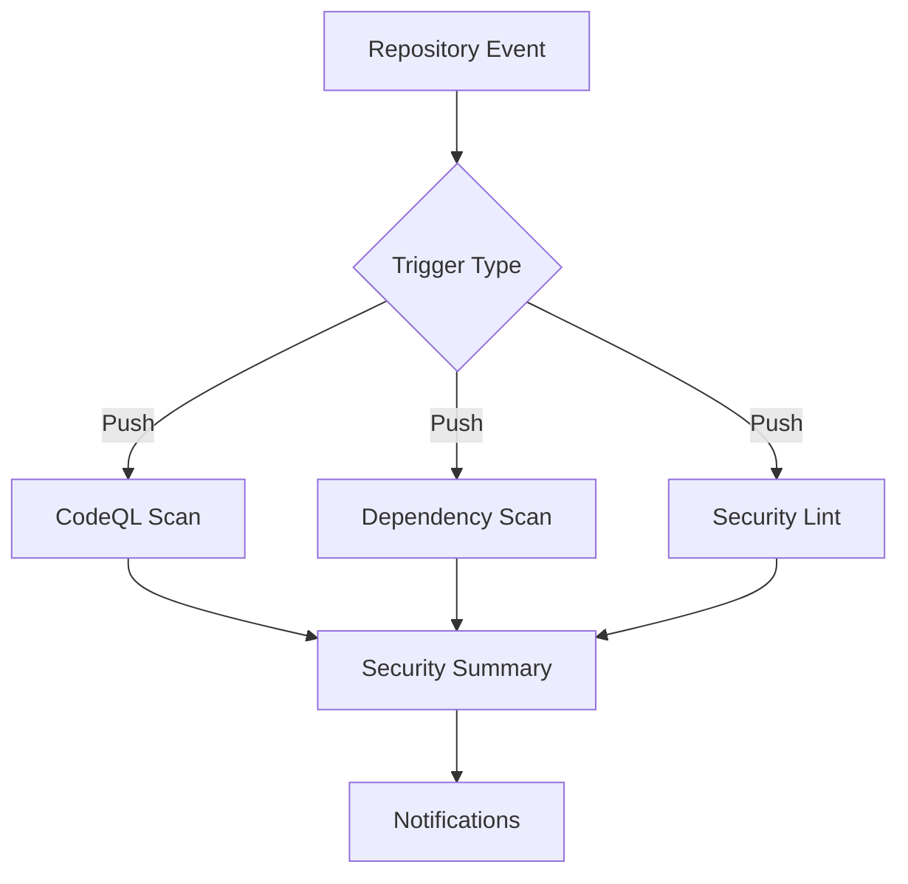
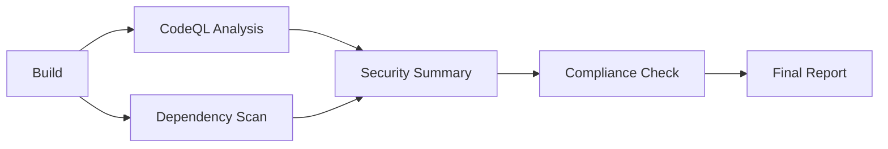

# Security Workflow Automation

This document provides detailed guidance on the security workflows and automation implemented in this project.

## Available Security Workflows

### 1. Automated Security Scanning Workflow

**Purpose**: Continuous security monitoring and vulnerability detection

**Triggers**:
- Every push to protected branches
- Pull request creation and updates
- Scheduled scans (daily, weekly, monthly)
- Manual dispatch for on-demand scanning

**Workflow Steps**:
1. **Environment Setup**
   - Checkout repository
   - Setup Node.js with caching
   - Install dependencies

2. **Security Analysis**
   - CodeQL static analysis
   - Dependency vulnerability scanning
   - Security linting
   - Secret detection

3. **Report Generation**
   - SARIF format reports
   - Security summary
   - Compliance status

4. **Notification**
   - PR comments for pull requests
   - Artifact uploads for review
   - Alert notifications for failures

### 2. Dependency Management Workflow

**Purpose**: Automated dependency updates and vulnerability patching

**Triggers**:
- Weekly scheduled runs (Dependabot)
- Manual dependency updates
- Security vulnerability alerts

**Workflow Steps**:
1. **Dependency Analysis**
   - Check for outdated packages
   - Scan for known vulnerabilities
   - License compliance verification

2. **Automated Updates**
   - Create update PRs
   - Run security scans
   - Test compatibility

3. **Review Process**
   - Automated testing
   - Security validation
   - Merge approval workflow

### 3. Security Compliance Workflow

**Purpose**: Ensure adherence to security policies and standards

**Triggers**:
- Weekly scheduled compliance checks
- Pre-deployment validation
- Manual compliance audits

**Workflow Steps**:
1. **Policy Validation**
   - Security policy presence check
   - Contact information verification
   - Disclosure process validation

2. **Compliance Assessment**
   - OWASP Top 10 compliance
   - License compliance
   - Security best practices

3. **Report Generation**
   - Compliance status report
   - Findings documentation
   - Remediation recommendations

## Security Workflow Configuration

### Environment Variables

Required environment variables for security workflows:

```yaml
# Repository Secrets
SNYK_TOKEN: ${{ secrets.SNYK_TOKEN }}
SECURITY_EMAIL: ${{ secrets.SECURITY_EMAIL }}
GITHUB_TOKEN: ${{ secrets.GITHUB_TOKEN }}

# Optional Configuration
SECURITY_SLACK_WEBHOOK: ${{ secrets.SECURITY_SLACK_WEBHOOK }}
SECURITY_EMAIL_WEBHOOK: ${{ secrets.SECURITY_EMAIL_WEBHOOK }}
```

### Workflow Permissions

Security workflows require specific permissions:

```yaml
permissions:
  contents: read          # Read repository contents
  security-events: write # Write security events
  actions: read          # Read workflow runs
  pull-requests: write   # Comment on PRs
  issues: write          # Create security issues
```

### Customization Options

#### Severity Thresholds
Configure minimum severity levels for reporting:

```yaml
# In security-dependencies.yml
yarn audit --level=moderate    # low, moderate, high, critical
npm audit --audit-level=high   # low, moderate, high, critical
```

#### Scan Frequency
Adjust scanning schedules based on project needs:

```yaml
# In security-scheduled.yml
schedule:
  # Daily comprehensive scan
  - cron: '0 1 * * *'
  # Weekly deep analysis
  - cron: '0 4 * * 0'
  # Monthly reporting
  - cron: '0 6 1 * *'
```

#### Notification Channels
Configure multiple notification methods:

```yaml
# Security alert notifications
- name: Notify security team
  run: |
    curl -X POST "$SECURITY_SLACK_WEBHOOK" \
      -H 'Content-type: application/json' \
      --data '{"text":"Security scan failed: ${{ github.repository }}"}'
```

## Workflow Orchestration

### Parallel Execution
Security workflows are designed to run in parallel when possible:



### Dependency Management
Workflows depend on each other for optimal execution:



## Workflow Templates

### Custom Security Scan
Template for creating custom security workflows:

```yaml
name: Custom Security Scan

on:
  workflow_dispatch:
    inputs:
      scan_type:
        description: 'Type of scan to run'
        required: true
        default: 'full'
      target:
        description: 'Target directory/package'
        required: false

jobs:
  custom-security-scan:
    runs-on: ubuntu-latest
    permissions:
      contents: read
      security-events: write

    steps:
      - uses: actions/checkout@v4
      - name: Setup environment
        # Custom setup steps
      - name: Run custom security scan
        # Custom security scanning logic
      - name: Process results
        # Result processing and reporting
```

### Security Gate Workflow
Template for security gates in deployment:

```yaml
name: Security Gate

on:
  pull_request:
    branches: [main, master]

jobs:
  security-gate:
    runs-on: ubuntu-latest
    if: github.event.pull_request.base.ref == 'main'

    steps:
      - name: Security validation
        # Security checks that must pass

      - name: Security approval check
        # Verify security team approval
```

## Integration with Development Tools

### IDE Integration
Security findings integrate with IDEs:

- **VS Code**: GitHub Security extension
- **JetBrains**: Security plugin integration
- **Vim/Emacs**: Security linting support

### Local Development
Run security scans locally:

```bash
# CodeQL local analysis
codeql database create . --language=javascript
codeql database analyze . --format=sarif-latest --output=results.sarif

# Dependency audit
yarn audit --level=moderate

# Security linting
npx eslint . --ext .js,.jsx,.ts,.tsx --plugin security
```

### Pre-commit Hooks
Security validation before commits:

```json
{
  "husky": {
    "hooks": {
      "pre-commit": "yarn lint && yarn audit --level=moderate"
    }
  }
}
```

## Monitoring and Alerting

### Security Metrics Dashboard
Key security metrics tracked:

- **Vulnerability Count**: Total vulnerabilities by severity
- **Fix Time**: Average time to remediate issues
- **Scan Success Rate**: Percentage of successful scans
- **False Positive Rate**: Accuracy of security findings

### Alert Configuration
Different alert levels based on findings:

```yaml
# Critical alerts (immediate)
- Critical vulnerabilities
- Security scan failures
- Emergency incidents

# High priority (within 1 hour)
- High severity vulnerabilities
- Compliance failures
- Security policy violations

# Normal priority (within 24 hours)
- Medium severity issues
- Dependency updates
- Security scan results
```

### Notification Channels
Multiple notification methods:

- **GitHub Security Tab**: Centralized view
- **Email Alerts**: Detailed security notifications
- **Slack Integration**: Real-time team notifications
- **Dashboard Updates**: Visual security metrics

## Troubleshooting Guide

### Common Workflow Issues

#### Scan Failures
**Symptoms**: Security workflows failing to complete

**Solutions**:
1. Check workflow permissions
2. Verify environment variables
3. Review dependency installation
4. Validate configuration files

#### False Positives
**Symptoms**: Security findings that don't represent real issues

**Solutions**:
1. Update rule configurations
2. Add appropriate ignore patterns
3. Create custom rule overrides
4. Report false positives to tool maintainers

#### Performance Issues
**Symptoms**: Security scans taking too long

**Solutions**:
1. Optimize dependency caching
2. Use incremental scanning
3. Adjust scan frequency
4. Review runner specifications

### Debugging Techniques

#### Workflow Debugging
```yaml
# Add debugging steps
- name: Debug environment
  run: |
    echo "Node version: $(node --version)"
    echo "Yarn version: $(yarn --version)"
    echo "Working directory: $(pwd)"
    ls -la

# Enable debug logging
env:
  ACTIONS_STEP_DEBUG: true
  ACTIONS_RUNNER_DEBUG: true
```

#### Local Testing
```bash
# Test workflows locally
act -j security-scan
docker-compose run security-scan

# Validate configurations
yamllint .github/workflows/
spectral .github/workflows/
```

## Best Practices

### Workflow Design Principles

1. **Security First**: All workflows designed with security as primary concern
2. **Fail Secure**: Workflows fail closed when security issues detected
3. **Comprehensive Coverage**: Multiple layers of security validation
4. **Performance Awareness**: Efficient resource usage and execution time

### Maintenance Practices

1. **Regular Updates**: Keep security tools and workflows updated
2. **Monitoring**: Continuous monitoring of workflow performance
3. **Documentation**: Maintain detailed workflow documentation
4. **Testing**: Regular testing of security workflows

### Team Collaboration

1. **Clear Responsibilities**: Defined roles for security team members
2. **Communication**: Clear channels for security discussions
3. **Training**: Regular security workflow training
4. **Knowledge Sharing**: Documentation and best practice sharing

---

*For questions about security workflows or to request customizations, contact the security team at security@example.com*