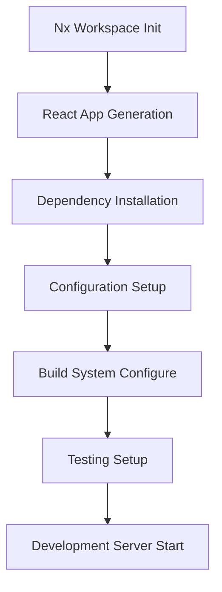
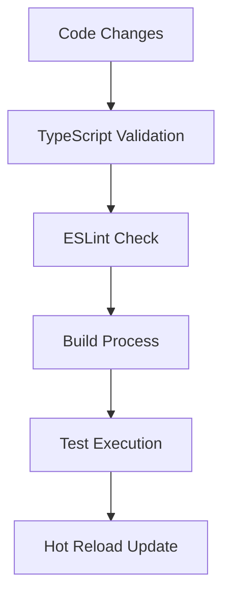
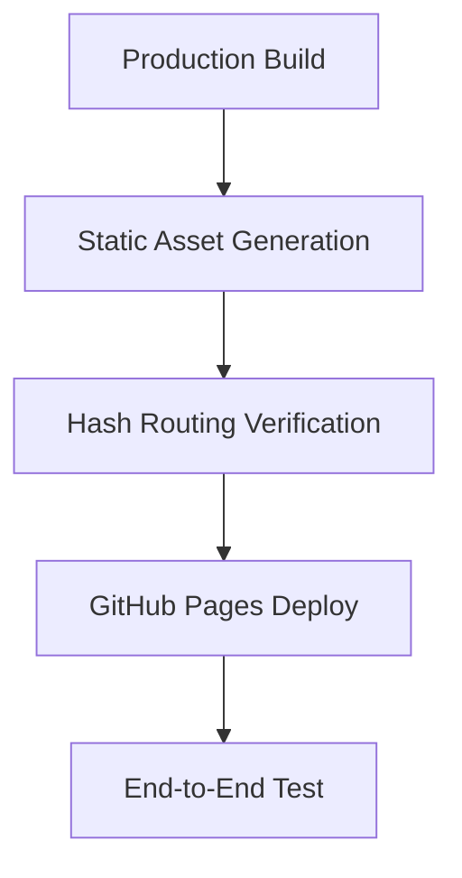

# Data Model

**Feature**: Nx Monorepo Webapp Setup
**Date**: 2025-12-03
**Storage**: IndexedDB via Dexie (client-side)

## Entity Overview

This is a project initialization feature, so the data model primarily focuses on configuration and development workflow data. The actual webapp built from this template will define its own domain-specific data models.

## Core Entities

### Workspace Configuration

```typescript
interface NxWorkspaceConfig {
  name: string;
  version: string;
  projects: Record<string, NxProjectConfig>;
  targetDefaults: Record<string, NxTargetConfig>;
  implicitDependencies: string[][];
  tasksRunnerOptions: Record<string, NxTasksRunnerConfig>;
  generators: Record<string, NxGeneratorConfig>;
  plugins?: (string | NxPluginConfig)[];
}
```

### Project Configuration

```typescript
interface NxProjectConfig {
  name: string;
  root: string;
  sourceRoot?: string;
  projectType: 'application' | 'library';
  tags?: string[];
  targets: Record<string, NxTargetConfig>;
  implicitDependencies?: string[];
}
```

### User Data Types (for @workspace/types package)

```typescript
/**
 * User preference settings stored in IndexedDB
 */
interface UserSettings {
  /** Theme preference */
  theme: 'light' | 'dark' | 'auto';
  /** Default language */
  language: string;
  /** Items per page in lists */
  itemsPerPage: number;
  /** Show discontinued kits */
  showDiscontinued: boolean;
  /** Default sort order */
  defaultSort: 'name' | 'release_date' | 'grade' | 'price';
  /** Enable notifications */
  notifications: boolean;
}

/**
 * User's personal Gunpla collection entry
 */
interface CollectionEntry {
  /** Unique identifier */
  id: string;
  /** Bandai SKU reference */
  sku: string;
  /** Quantity owned */
  quantity: number;
  /** Condition of the kit */
  condition: 'new' | 'used' | 'damaged' | 'box_only';
  /** When the kit was purchased */
  purchaseDate?: Date;
  /** Purchase price in local currency */
  purchasePrice?: number;
  /** User notes about the kit */
  notes?: string;
  /** When added to collection */
  addedAt: Date;
  /** Last updated timestamp */
  updatedAt: Date;
}

/**
 * User wishlist entry
 */
interface WishlistEntry {
  /** Unique identifier */
  id: string;
  /** Bandai SKU reference */
  sku: string;
  /** Priority level for purchasing */
  priority: 'low' | 'medium' | 'high';
  /** Target price */
  targetPrice?: number;
  /** User notes */
  notes?: string;
  /** When added to wishlist */
  addedAt: Date;
}

/**
 * Build progress log entry
 */
interface BuildLog {
  /** Unique identifier */
  id: string;
  /** Bandai SKU reference */
  sku: string;
  /** Build title */
  title: string;
  /** Current build status */
  status: 'planning' | 'in_progress' | 'completed' | 'on_hold';
  /** Progress percentage (0-100) */
  progress: number;
  /** When build was started */
  startDate?: Date;
  /** When build was completed */
  completedDate?: Date;
  /** Detailed build notes */
  notes: string;
  /** Build progress images */
  images: string[];
  /** When log was created */
  createdAt: Date;
  /** Last updated timestamp */
  updatedAt: Date;
}
```

### Development Environment

```typescript
interface DevEnvironmentConfig {
  nodeVersion: string;
  packageManager: 'npm' | 'yarn' | 'pnpm';
  typescript: TypeScriptConfig;
  eslint: ESLintConfig;
  vitest: VitestConfig;
  playwright: PlaywrightConfig;
}
```

### CSS/Styling Configuration

```typescript
interface VanillaExtractConfig {
  identName: string;
  debugClassName?: boolean;
  scopeStrategy?: 'module' | 'global';
  runtime?: boolean;
  esbuildOptions?: Record<string, unknown>;
  vitePluginOptions?: Record<string, unknown>;
}

interface CSSVariableConfig {
  prefix: string;
  theme: Record<string, CSSVariableValue>;
  breakpoints: Record<string, string>;
  colors: Record<string, string>;
  spacing: Record<string, string>;
  typography: Record<string, TypographyConfig>;
}

interface CSSVariableValue {
  value: string;
  description?: string;
  category: 'color' | 'spacing' | 'typography' | 'layout' | 'animation';
}

interface TypographyConfig {
  fontFamily: string[];
  fontSize: Record<string, string>;
  fontWeight: Record<string, number>;
  lineHeight: Record<string, number>;
  letterSpacing: Record<string, string>;
}

interface DesignToken {
  name: string;
  value: string | number;
  type: 'color' | 'size' | 'spacing' | 'typography' | 'shadow' | 'border';
  category: string;
  description?: string;
}

interface ThemeContract {
  colors: {
    primary: string;
    secondary: string;
    accent: string;
    background: string;
    surface: string;
    text: string;
    error: string;
    warning: string;
    success: string;
    info: string;
  };
  spacing: {
    xs: string;
    sm: string;
    md: string;
    lg: string;
    xl: string;
    xxl: string;
  };
  breakpoints: {
    mobile: string;
    tablet: string;
    desktop: string;
    widescreen: string;
  };
  typography: {
    fontFamily: string;
    fontSize: Record<string, string>;
    fontWeight: Record<string, number>;
    lineHeight: Record<string, string>;
  };
  shadows: {
    sm: string;
    md: string;
    lg: string;
    xl: string;
  };
  borders: {
    radius: Record<string, string>;
    width: Record<string, string>;
  };
}
```

## Application Data Patterns

Since this is a template initialization, the actual webapp will implement its own data models. Recommended patterns for the created application:

### Client-side Storage Schema

```typescript
// Gunpla Webapp User Database Schema (IndexedDB via Dexie)
interface AppDatabase {
  // User preferences and settings
  settings: {
    key: string;
    value: unknown;
    updatedAt: Date;
  };

  // User's personal Gunpla collection
  userCollection: {
    id: string;
    sku: string; // Bandai SKU
    quantity: number;
    condition: 'new' | 'used' | 'damaged' | 'box_only';
    purchaseDate?: Date;
    purchasePrice?: number;
    notes?: string;
    addedAt: Date;
    updatedAt: Date;
  };

  // User's wishlist
  wishlist: {
    id: string;
    sku: string; // Bandai SKU
    priority: 'low' | 'medium' | 'high';
    notes?: string;
    addedAt: Date;
  };

  // Build logs and progress tracking
  buildLogs: {
    id: string;
    sku: string; // Bandai SKU
    title: string;
    status: 'planning' | 'in_progress' | 'completed' | 'on_hold';
    progress: number; // 0-100
    startDate?: Date;
    completedDate?: Date;
    notes: string;
    images: string[]; // Base64 or image URLs
    createdAt: Date;
    updatedAt: Date;
  };

  // Local cache of frequently accessed data
  cache: {
    id: string;
    data: unknown;
    expiresAt: Date;
    createdAt: Date;
    tags: string[];
  };
}
```

### Configuration Data

```typescript
interface AppConfig {
  app: {
    name: string;
    version: string;
    description: string;
  };
  routing: {
    type: 'hash'; // Fixed for GitHub Pages compatibility
    basePath: string;
  };
  ui: {
    theme: MantineThemeConfig;
    components: ComponentRegistry;
    styling: {
      vanillaExtract: VanillaExtractConfig;
      cssVariables: CSSVariableConfig;
    };
  };
  storage: {
    databaseName: string;
    version: number;
  };
  deployment: {
    target: 'github-pages';
    baseUrl: string;
  };
}
```

## State Management Patterns

### React State Structure

```typescript
interface AppState {
  // Router state (managed by TanStack Router)
  router: RouterState;

  // UI state (managed by React state/context)
  ui: {
    theme: MantineTheme;
    loading: boolean;
    notifications: Notification[];
  };

  // Data state (managed by TanStack Query + IndexedDB)
  data: {
    [key: string]: QueryState;
  };
}
```

### IndexedDB Operations

```typescript
// Dexie wrapper for type-safe database operations
class AppDatabase extends Dexie {
  settings!: Table<SettingRecord>;
  cache!: Table<CacheRecord>;

  constructor() {
    super('WebAppDatabase');
    this.version(1).stores({
      settings: '++id, key, updatedAt',
      cache: '++id, expiresAt, createdAt',
    });
  }
}
```

## Validation Rules

### Configuration Validation

```typescript
const workspaceConfigSchema = z.object({
  name: z.string().min(1),
  version: z.string().regex(/^\d+\.\d+\.\d+$/),
  projects: z.record(z.unknown()),
  targetDefaults: z.record(z.unknown()),
});

const appConfigSchema = z.object({
  app: z.object({
    name: z.string().min(1),
    version: z.string(),
    description: z.string(),
  }),
  routing: z.object({
    type: z.literal('hash'),
    basePath: z.string(),
  }),
});
```

### TypeScript Validation

```typescript
// Strict TypeScript configuration enforcement
const typeScriptConfig: TypeScriptConfig = {
  compilerOptions: {
    strict: true,
    noImplicitAny: true,
    strictNullChecks: true,
    noImplicitReturns: true,
    noUnusedLocals: true,
    noUnusedParameters: true,
  },
};
```

## Test Organization

### Test File Naming Conventions

```typescript
/**
 * Test file naming pattern following the convention:
 * {name}.{unit,component,integration,e2e}.test.ts
 */
interface TestFileNamePattern {
  /** Base name of the feature or component being tested */
  name: string;
  /** Test type suffix indicating the scope and purpose */
  testType: 'unit' | 'component' | 'integration' | 'e2e';
  /** File extension (always .test.ts for TypeScript test files) */
  extension: '.test.ts';
}

/**
 * Test type definitions with their characteristics and scopes
 */
interface TestTypeDefinition {
  /** Unique identifier for the test type */
  id: string;
  /** Human-readable name of the test type */
  name: string;
  /** Description of what this test type covers */
  description: string;
  /** Typical file size (lines of code) */
  typicalSize: 'small' | 'medium' | 'large';
  /** Execution speed */
  speed: 'fast' | 'medium' | 'slow';
  /** Whether this test type requires external resources */
  requiresExternalResources: boolean;
  /** Recommended tools and frameworks */
  tools: string[];
}

/**
 * Test type categories with their specific characteristics
 */
const TEST_TYPES: Record<TestTypeDefinition['id'], TestTypeDefinition> = {
  unit: {
    id: 'unit',
    name: 'Unit Tests',
    description: 'Test individual functions, classes, or components in isolation',
    typicalSize: 'small',
    speed: 'fast',
    requiresExternalResources: false,
    tools: ['Vitest', 'React Testing Library', 'Jest']
  },
  component: {
    id: 'component',
    name: 'Component Tests',
    description: 'Test React components with mocked dependencies',
    typicalSize: 'medium',
    speed: 'medium',
    requiresExternalResources: false,
    tools: ['Vitest', 'React Testing Library', '@testing-library/react']
  },
  integration: {
    id: 'integration',
    name: 'Integration Tests',
    description: 'Test multiple components or modules working together',
    typicalSize: 'medium',
    speed: 'medium',
    requiresExternalResources: true,
    tools: ['Vitest', 'React Testing Library', 'MSW (Mock Service Worker)']
  },
  e2e: {
    id: 'e2e',
    name: 'End-to-End Tests',
    description: 'Test complete user workflows in a browser environment',
    typicalSize: 'large',
    speed: 'slow',
    requiresExternalResources: true,
    tools: ['Playwright', 'Cypress']
  }
} as const;
```

### Test Directory Structure

```typescript
/**
 * Recommended directory structure for organizing test files
 */
interface TestDirectoryStructure {
  /** Root directories for different types of tests */
  directories: {
    /** Unit tests co-located with source files */
    unit: string;
    /** Component tests in dedicated directories */
    component: string;
    /** Integration tests in dedicated directories */
    integration: string;
    /** End-to-end tests in dedicated directories */
    e2e: string;
  };
  /** File organization patterns */
  patterns: {
    /** Co-located unit tests next to source files */
    collocated: boolean;
    /** Centralized test directories for integration and e2e */
    centralized: boolean;
  };
}

/**
 * Test file location recommendations
 */
interface TestFileLocation {
  /** Relative path from the test file to the source file */
  sourcePath: string;
  /** Directory containing the test file */
  testDirectory: string;
  /** Naming pattern for the test file */
  fileName: string;
  /** Whether this test is co-located with source code */
  isCollocated: boolean;
}

/**
 * Recommended test file locations by type
 */
const TEST_LOCATIONS: Record<TestTypeDefinition['id'], TestFileLocation[]> = {
  unit: [
    {
      sourcePath: '../src/components/Button.tsx',
      testDirectory: 'src/components/',
      fileName: 'Button.unit.test.ts',
      isCollocated: true
    },
    {
      sourcePath: '../src/utils/format.ts',
      testDirectory: 'src/utils/',
      fileName: 'format.unit.test.ts',
      isCollocated: true
    }
  ],
  component: [
    {
      sourcePath: '../src/components/Button.tsx',
      testDirectory: 'src/components/__tests__/',
      fileName: 'Button.component.test.ts',
      isCollocated: false
    }
  ],
  integration: [
    {
      sourcePath: '../src/',
      testDirectory: 'tests/integration/',
      fileName: 'user-workflow.integration.test.ts',
      isCollocated: false
    }
  ],
  e2e: [
    {
      sourcePath: '../',
      testDirectory: 'tests/e2e/',
      fileName: 'user-registration.e2e.test.ts',
      isCollocated: false
    }
  ]
} as const;
```

### Test Configuration by Type

```typescript
/**
 * Vitest configuration for different test types
 */
interface VitestTestConfig {
  /** Test environment setup */
  environment: 'jsdom' | 'node' | 'happy-dom';
  /** Files to include in test runs */
  include: string[];
  /** Files to exclude from test runs */
  exclude: string[];
  /** Setup files to load before tests */
  setupFiles: string[];
  /** Coverage configuration */
  coverage: {
    /** Directories to include in coverage */
    include: string[];
    /** Directories to exclude from coverage */
    exclude: string[];
    /** Coverage thresholds */
    thresholds: {
      statements: number;
      branches: number;
      functions: number;
      lines: number;
    };
  };
}

/**
 * Playwright configuration for e2e tests
 */
interface PlaywrightTestConfig {
  /** Test directory location */
  testDir: string;
  /** Fully parallel test execution */
  fullyParallel: boolean;
  /** Number of retries on failure */
  retries: number;
  /** Number of worker processes */
  workers: number;
  /** Reporter configuration */
  reporter: string | string[];
  /** Browser configurations */
  projects: {
    name: string;
    use: {
      /** Browser engine */
      browserName: 'chromium' | 'firefox' | 'webkit';
      /** Viewport size */
      viewport: { width: number; height: number };
      /** Ignore HTTPS errors */
      ignoreHTTPSErrors: boolean;
    };
  }[];
}

/**
 * CLI error handling and retry configuration
 */
interface CLIErrorHandling {
  /** Maximum number of retry attempts for failed requests */
  maxRetries: number;
  /** Initial delay in milliseconds for exponential backoff */
  initialDelay: number;
  /** Maximum delay in milliseconds */
  maxDelay: number;
  /** Circuit breaker threshold after which to stop retrying */
  circuitBreakerThreshold: number;
  /** Rate limiting delay between requests in milliseconds */
  rateLimitDelay: number;
  /** Timeout for individual requests in milliseconds */
  requestTimeout: number;
}

/**
 * CLI execution result with error tracking
 */
interface CLIExecutionResult {
  /** Whether the operation was successful */
  success: boolean;
  /** Number of items processed successfully */
  processedCount: number;
  /** Number of items that failed */
  failedCount: number;
  /** Array of failed items with error details */
  errors: Array<{
    item: string;
    error: string;
    retryCount: number;
    timestamp: Date;
  }>;
  /** Execution duration in milliseconds */
  duration: number;
  /** Checkpoint data for resuming execution */
  checkpoint?: {
    lastProcessedItem: string;
    processedItems: string[];
    timestamp: Date;
  };
}

/**
 * Cache management configuration
 */
interface CacheConfig {
  /** Maximum age of cached content in hours */
  maxAge: number;
  /** Whether to compress cached content */
  compress: boolean;
  /** Maximum cache size in MB */
  maxSize: number;
  /** Cache cleanup policy */
  cleanupPolicy: 'lru' | 'fifo' | 'size-based';
}

/**
 * Security monitoring and event tracking
 */
interface SecurityEvent {
  /** Unique event identifier */
  id: string;
  /** Event type and category */
  type: 'xss_attempt' | 'injection_attempt' | 'rate_limit_exceeded' | 'unauthorized_access' | 'data_breach';
  /** Event severity level */
  severity: 'low' | 'medium' | 'high' | 'critical';
  /** Timestamp when event occurred */
  timestamp: Date;
  /** Source IP or user identifier */
  source: string;
  /** Target resource or endpoint */
  target: string;
  /** Event details and context */
  details: Record<string, unknown>;
  /** Whether event was blocked */
  blocked: boolean;
}

/**
 * Performance metrics tracking
 */
interface PerformanceMetrics {
  /** Core Web Vitals */
  webVitals: {
    /** Largest Contentful Paint */
    lcp: number;
    /** First Input Delay */
    fid: number;
    /** Cumulative Layout Shift */
    cls: number;
    /** Time to First Byte */
    ttfb: number;
  };
  /** Application-specific metrics */
  application: {
    /** Bundle size in bytes */
    bundleSize: number;
    /** Number of network requests */
    requestCount: number;
    /** Total load time in milliseconds */
    loadTime: number;
    /** JavaScript execution time */
    jsExecutionTime: number;
  };
  /** User experience metrics */
  userExperience: {
    /** Error rate percentage */
    errorRate: number;
    /** Session duration in minutes */
    sessionDuration: number;
    /** Bounce rate percentage */
    bounceRate: number;
    /** Pages per session */
    pagesPerSession: number;
  };
}

/**
 * CLI monitoring and analytics
 */
interface CLIMetrics {
  /** Execution statistics */
  execution: {
    /** Total number of operations */
    totalOperations: number;
    /** Success rate percentage */
    successRate: number;
    /** Average execution time in milliseconds */
    averageExecutionTime: number;
    /** Total data processed in MB */
    totalDataProcessed: number;
  };
  /** Error analysis */
  errors: {
    /** Number of network errors */
    networkErrors: number;
    /** Number of parsing errors */
    parsingErrors: number;
    /** Number of validation errors */
    validationErrors: number;
    /** Most common error types */
    commonErrors: Array<{
      type: string;
      count: number;
      lastOccurred: Date;
    }>;
  };
  /** Resource utilization */
  resources: {
    /** Peak memory usage in MB */
    peakMemoryUsage: number;
    /** CPU usage percentage */
    cpuUsage: number;
    /** Disk space used for cache in MB */
    cacheDiskUsage: number;
    /** Network bandwidth usage in MB */
    networkUsage: number;
  };
}

/**
 * Application health check status
 */
interface HealthCheck {
  /** Overall health status */
  status: 'healthy' | 'degraded' | 'unhealthy';
  /** Timestamp of last health check */
  timestamp: Date;
  /** Individual component health */
  components: {
    /** Database connectivity and performance */
    database: {
      status: 'healthy' | 'degraded' | 'unhealthy';
      responseTime: number;
      errorCount: number;
    };
    /** Cache performance and availability */
    cache: {
      status: 'healthy' | 'degraded' | 'unhealthy';
      hitRate: number;
      size: number;
      errorCount: number;
    };
    /** External API availability */
    externalAPIs: {
      status: 'healthy' | 'degraded' | 'unhealthy';
      responseTime: number;
      availability: number;
    };
    /** Storage system health */
    storage: {
      status: 'healthy' | 'degraded' | 'unhealthy';
      availableSpace: number;
      usedSpace: number;
      errorRate: number;
    };
  };
}

/**
 * Test configuration by test type
 */
const TEST_CONFIGURATIONS: Record<TestTypeDefinition['id'], VitestTestConfig | PlaywrightTestConfig> = {
  unit: {
    environment: 'node',
    include: ['**/*.unit.test.ts'],
    exclude: ['node_modules/**', 'dist/**'],
    setupFiles: ['src/test/setup/unit.ts'],
    coverage: {
      include: ['src/**/*.ts', 'src/**/*.tsx'],
      exclude: ['src/**/*.test.ts', 'src/**/*.stories.tsx', 'src/test/**'],
      thresholds: {
        statements: 80,
        branches: 75,
        functions: 80,
        lines: 80
      }
    }
  },
  component: {
    environment: 'jsdom',
    include: ['**/*.component.test.ts'],
    exclude: ['node_modules/**', 'dist/**'],
    setupFiles: ['src/test/setup/component.ts'],
    coverage: {
      include: ['src/components/**/*.ts', 'src/components/**/*.tsx'],
      exclude: ['src/components/**/*.test.ts', 'src/components/**/*.stories.tsx'],
      thresholds: {
        statements: 85,
        branches: 80,
        functions: 85,
        lines: 85
      }
    }
  },
  integration: {
    environment: 'jsdom',
    include: ['**/*.integration.test.ts'],
    exclude: ['node_modules/**', 'dist/**'],
    setupFiles: ['src/test/setup/integration.ts'],
    coverage: {
      include: ['src/**/*.ts', 'src/**/*.tsx'],
      exclude: ['src/**/*.test.ts', 'src/**/*.stories.tsx', 'src/test/**'],
      thresholds: {
        statements: 75,
        branches: 70,
        functions: 75,
        lines: 75
      }
    }
  },
  e2e: {
    testDir: 'tests/e2e',
    fullyParallel: true,
    retries: 2,
    workers: 4,
    reporter: ['html', 'json'],
    projects: [
      {
        name: 'chromium',
        use: {
          browserName: 'chromium',
          viewport: { width: 1280, height: 720 },
          ignoreHTTPSErrors: true
        }
      },
      {
        name: 'firefox',
        use: {
          browserName: 'firefox',
          viewport: { width: 1280, height: 720 },
          ignoreHTTPSErrors: true
        }
      },
      {
        name: 'webkit',
        use: {
          browserName: 'webkit',
          viewport: { width: 1280, height: 720 },
          ignoreHTTPSErrors: true
        }
      }
    ]
  }
} as const;
```

## Data Flow Patterns

### Initialization Flow



### Development Workflow



### Deployment Flow



## Migration Strategy

### Configuration Migration

```typescript
interface ConfigMigration {
  version: string;
  migrate: (oldConfig: unknown) => unknown;
  description: string;
}

const migrations: ConfigMigration[] = [
  {
    version: '1.0.0',
    migrate: (config) => ({ ...config, migrated: true }),
    description: 'Initial configuration format',
  },
];
```

### Database Versioning

```typescript
// IndexedDB version migration strategy
const databaseMigrations = {
  1: (db: AppDatabase) => {
    // Initial database setup
    db.settings.mapToClass(SettingRecord);
    db.cache.mapToClass(CacheRecord);
  },
  2: (db: AppDatabase) => {
    // Future migration example
    db.version(2).stores({
      settings: '++id, key, updatedAt, category',
      cache: '++id, expiresAt, createdAt, tags',
    });
  },
};
```

## Performance Considerations

### IndexedDB Optimization

- Use compound indexes for frequent queries
- Implement data expiration policies
- Batch operations for better performance
- Use transactions for data consistency

### React Performance

- Implement code splitting with lazy loading
- Use React.memo for component optimization
- Optimize re-renders with proper dependency arrays
- Implement virtual scrolling for large lists

## Security Considerations

### Data Validation

- Validate all IndexedDB operations
- Implement input sanitization
- Use TypeScript for type safety
- Implement error boundaries

### Configuration Security

- Validate configuration files on startup
- Implement secure default values
- Use environment variables for sensitive data
- Implement CSP headers for production

## Notes

- This data model serves as a template foundation
- Actual webapp implementations should extend and customize based on specific requirements
- All configurations favor TypeScript strict mode for maximum type safety
- IndexedDB usage assumes client-side data storage requirements
- GitHub Pages deployment constraints influence routing and configuration decisions