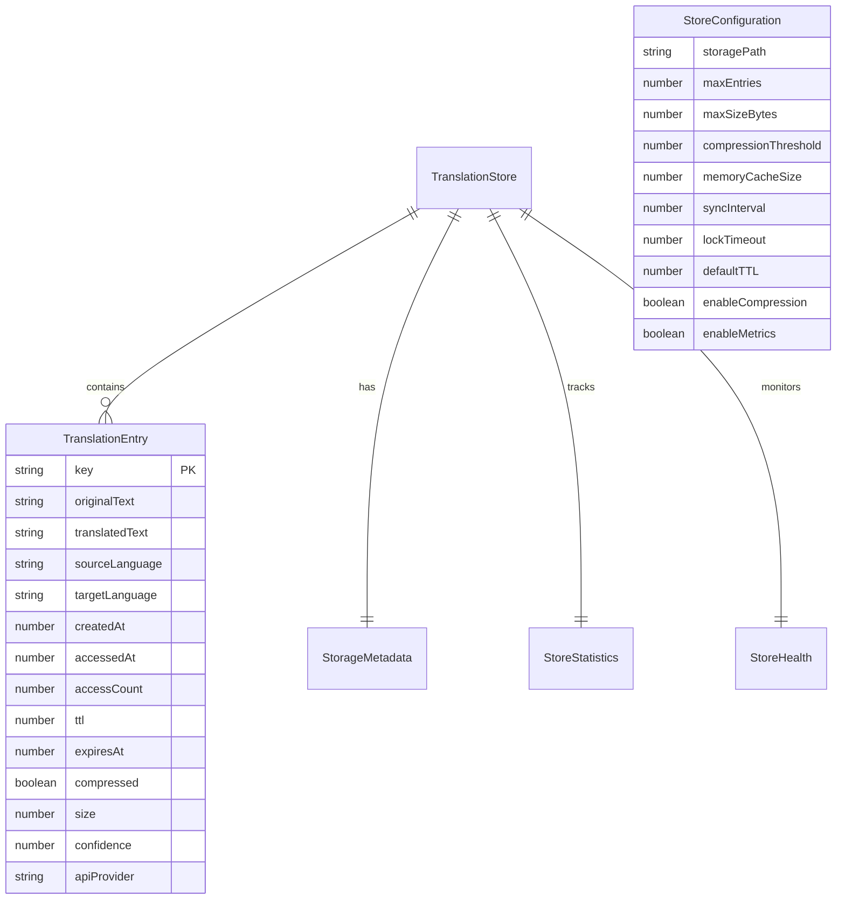
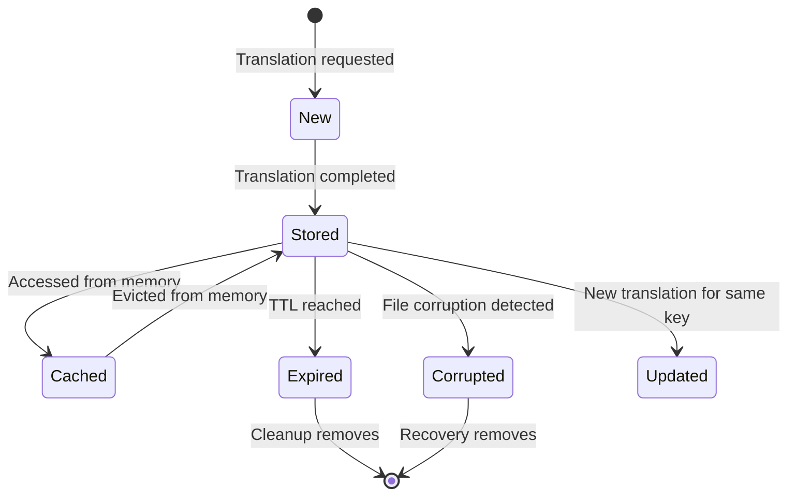
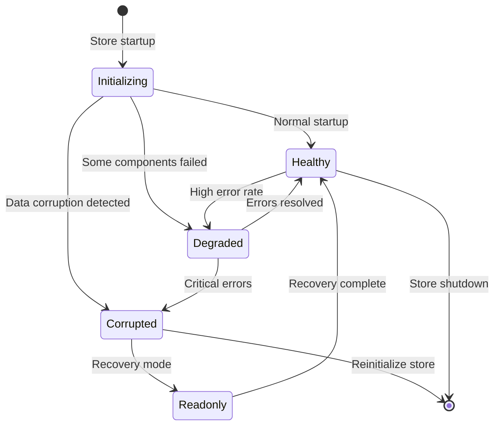

# TranslationStore Data Model

## Core Entities

### TranslationEntry

Represents a single translation with full metadata and lifecycle information.

```typescript
interface TranslationEntry {
  // Core translation data
  key: string;                    // Unique identifier: "source:target:text_hash"
  originalText: string;          // Source text (Japanese)
  translatedText: string;        // Target text (English)
  sourceLanguage: string;        // Source language code (e.g., "ja")
  targetLanguage: string;        // Target language code (e.g., "en")

  // Metadata
  createdAt: number;             // Unix timestamp when created
  accessedAt: number;            // Unix timestamp of last access
  accessCount: number;           // Number of times this translation was accessed

  // Lifecycle management
  ttl?: number;                  // Time-to-live in milliseconds (optional)
  expiresAt?: number;            // Calculated expiration timestamp

  // Storage optimization
  compressed: boolean;           // Whether data is compressed
  size: number;                  // Size of compressed data in bytes

  // Quality indicators
  confidence?: number;           // Translation confidence score (0-1)
  apiProvider?: string;          // Which API provided the translation
}
```

### TranslationStore

Manages the collection of translation entries with configuration and statistics.

```typescript
interface TranslationStore {
  // Store configuration
  version: string;               // Store format version for compatibility
  config: StoreConfiguration;

  // Runtime statistics
  statistics: StoreStatistics;

  // Health and performance metrics
  health: StoreHealth;
}

interface StoreConfiguration {
  // Storage settings
  storagePath: string;           // Directory path for store files
  maxEntries: number;            // Maximum number of entries to store
  maxSizeBytes: number;          // Maximum disk usage in bytes
  compressionThreshold: number;   // Minimum size to trigger compression

  // Performance settings
  memoryCacheSize: number;       // Number of entries to keep in memory
  syncInterval: number;          // Interval between sync operations (ms)
  lockTimeout: number;           // Timeout for file lock operations

  // Behavior settings
  defaultTTL: number;            // Default time-to-live for entries
  enableCompression: boolean;    // Whether to use compression
  enableMetrics: boolean;        // Whether to collect performance metrics
}

interface StoreStatistics {
  // Entry counts
  totalEntries: number;          // Total entries in store
  activeEntries: number;         // Non-expired entries
  expiredEntries: number;        // Expired entries

  // Storage metrics
  diskUsageBytes: number;        // Current disk usage
  compressionRatio: number;      // Average compression ratio

  // Performance metrics
  hitRate: number;               // Cache hit rate (0-1)
  averageLookupTime: number;     // Average lookup time in milliseconds
  averageWriteTime: number;      // Average write time in milliseconds

  // Access patterns
  totalLookups: number;          // Total lookup operations
  totalWrites: number;           // Total write operations
  totalHits: number;             // Total cache hits

  // Timestamps
  lastCleanup: number;           // Last cleanup operation timestamp
  lastOptimization: number;      // Last optimization operation timestamp
  createdAt: number;             // Store creation timestamp
  updatedAt: number;             // Last update timestamp
}

interface StoreHealth {
  status: 'healthy' | 'degraded' | 'corrupted' | 'readonly';
  errors: StoreError[];
  warnings: StoreWarning[];

  // Health indicators
  diskSpaceAvailable: number;    // Available disk space in bytes
  fragmentationLevel: number;     // Database fragmentation level
  lockStatus: 'unlocked' | 'locked' | 'stuck';

  lastHealthCheck: number;       // Last health check timestamp
}

interface StoreError {
  code: string;
  message: string;
  timestamp: number;
  severity: 'low' | 'medium' | 'high' | 'critical';
  resolved: boolean;
}

interface StoreWarning {
  code: string;
  message: string;
  timestamp: number;
  acknowledged: boolean;
}
```

### StorageMetadata

Tracks store-level metadata and configuration for persistence.

```typescript
interface StorageMetadata {
  // Store identification
  storeId: string;               // Unique store identifier
  version: string;               // Store format version

  // Creation and migration info
  createdAt: number;             // Store creation timestamp
  migratedAt?: number;           // Last migration timestamp
  previousVersion?: string;      // Previous version for rollback

  // Compatibility
  minCompatibleVersion: string;  // Minimum compatible client version
  maxCompatibleVersion: string;  // Maximum compatible client version

  // Feature flags
  features: {
    compression: boolean;
    encryption: boolean;
    metrics: boolean;
    healthMonitoring: boolean;
  };

  // Security
  checksum: string;              // Metadata checksum for integrity
  encrypted: boolean;            // Whether store is encrypted
}
```

## Data Relationships



## Data Validation Rules

### TranslationEntry Validation

```typescript
import { z } from "zod";

const TranslationEntrySchema = z.object({
  key: z.string().min(1).max(255),
  originalText: z.string().min(1).max(10000),
  translatedText: z.string().min(1).max(10000),
  sourceLanguage: z.string().length(2),
  targetLanguage: z.string().length(2),
  createdAt: z.number().int().positive(),
  accessedAt: z.number().int().positive(),
  accessCount: z.number().int().min(0),
  ttl: z.number().int().positive().optional(),
  expiresAt: z.number().int().positive().optional(),
  compressed: z.boolean(),
  size: z.number().int().min(0),
  confidence: z.number().min(0).max(1).optional(),
  apiProvider: z.string().min(1).max(50).optional(),
});

// Custom validation functions
export class TranslationValidator {
  static validateLanguageCode(code: string): boolean {
    return /^[a-z]{2}(-[A-Z]{2})?$/.test(code);
  }

  static validateTextHash(key: string, originalText: string, sourceLang: string, targetLang: string): boolean {
    const expectedKey = `${sourceLang}:${targetLang}:${this.hashText(originalText)}`;
    return key === expectedKey;
  }

  static validateTTL(ttl?: number): boolean {
    return !ttl || (ttl > 0 && ttl <= 365 * 24 * 60 * 60 * 1000); // Max 1 year
  }

  static validateExpiration(createdAt: number, ttl?: number, expiresAt?: number): boolean {
    if (!ttl && !expiresAt) return true;
    if (expiresAt) return expiresAt > createdAt;
    return (createdAt + ttl!) > Date.now();
  }

  private static hashText(text: string): string {
    // Simple hash for key generation - in production use crypto
    return Buffer.from(text).toString('base64').substring(0, 16);
  }
}
```

## State Transitions

### Translation Entry Lifecycle



### Store Health States



## Performance Considerations

### Indexing Strategy

```sql
-- Primary SQLite indexes for optimal performance
CREATE INDEX idx_translation_key ON translations(key);
CREATE INDEX idx_translation_expires ON translations(expiresAt) WHERE expiresAt IS NOT NULL;
CREATE INDEX idx_translation_accessed ON translations(accessedAt);
CREATE INDEX idx_translation_created ON translations(createdAt);

-- Composite indexes for common queries
CREATE INDEX idx_translation_lang_pair ON translations(sourceLanguage, targetLanguage);
CREATE INDEX idx_translation_active ON translations(key) WHERE expiresAt > strftime('%s', 'now');
```

### Memory Optimization

- **Hot data**: Most frequently accessed entries kept in memory
- **Cold data**: Less frequently accessed entries disk-only
- **Compression**: Applied to entries >1KB to reduce memory footprint
- **Cleanup**: Periodic removal of expired and least-used entries

### Disk I/O Optimization

- **Batch writes**: Group multiple writes for efficiency
- **Async operations**: Non-blocking disk operations where possible
- **Write-ahead logging**: SQLite WAL mode for concurrent access
- **Connection pooling**: Reuse database connections for efficiency