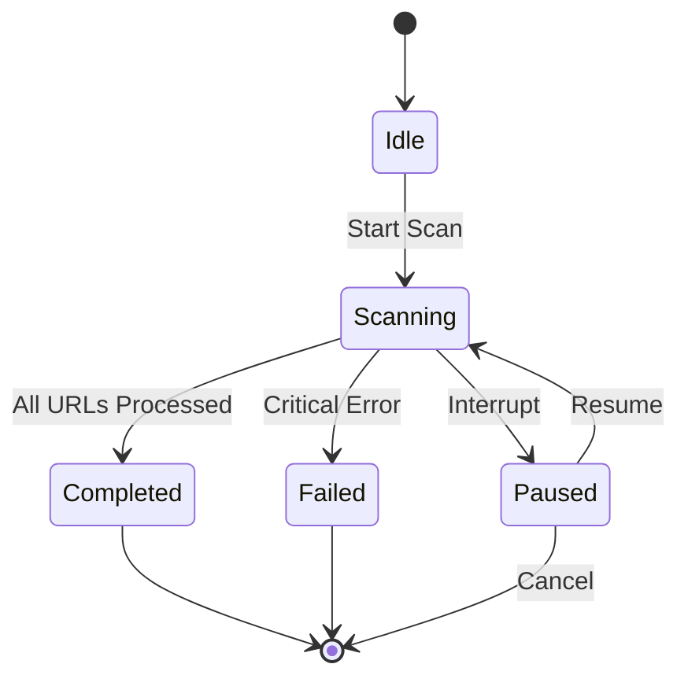

# Data Model: URL Validation Scanner

**Date**: 2025-12-05
**Purpose**: Define data structures and entity relationships for URL validation scanner

## Core Entities

### URLCheckResult
Represents the outcome of checking a single URL for validity and data extraction viability.

```typescript
interface URLCheckResult {
  /** The URL that was checked */
  url: string;

  /** Timestamp of when the check was performed (ISO 8601) */
  timestamp: string;

  /** Overall validity status */
  validity: 'valid' | 'invalid' | 'error';

  /** HTTP status code (if request completed) */
  statusCode?: number;

  /** Whether essential Gundam data is available in initial HTML */
  hasStaticData: boolean;

  /** Type of data availability */
  dataType: 'complete' | 'partial' | 'none';

  /** Confidence in the static/dynamic classification (0-1) */
  confidence: number;

  /** Detected indicators that influenced classification */
  indicators: string[];

  /** Error message if check failed */
  errorMessage?: string;

  /** Final destination URL if redirects were followed */
  finalUrl?: string;

  /** Content type from response headers */
  contentType?: string;

  /** Response size in bytes */
  responseSize?: number;

  /** Time taken for the request in milliseconds */
  requestTime?: number;
}
```

### ProgressState
Represents the current scanning state for resume capability.

```typescript
interface ProgressState {
  /** Unique identifier for this scan session */
  scanId: string;

  /** Timestamp when scan started */
  startedAt: string;

  /** Last processed URL index or identifier */
  lastProcessedIndex: number;

  /** Total URLs processed so far */
  totalProcessed: number;

  /** URLs successfully classified */
  successfulCount: number;

  /** URLs that failed with errors */
  errorCount: number;

  /** Scan configuration used */
  configuration: ScanConfiguration;

  /** Current scan status */
  status: 'running' | 'paused' | 'completed' | 'failed';

  /** Optional estimated completion time */
  estimatedCompletion?: string;
}
```

### ScanConfiguration
Represents scan parameters and settings.

```typescript
interface ScanConfiguration {
  /** URL patterns to scan */
  urlPatterns: URLPattern[];

  /** Maximum concurrent requests */
  concurrency: number;

  /** Request timeout in milliseconds */
  timeoutMs: number;

  /** Number of retry attempts for failed requests */
  retryAttempts: number;

  /** Delay between requests in milliseconds */
  requestDelayMs: number;

  /** Output directory for results */
  outputDirectory: string;

  /** Whether to follow redirects */
  followRedirects: boolean;

  /** Maximum number of redirects to follow */
  maxRedirects: number;

  /** Custom user agent string */
  userAgent?: string;

  /** Progress file location */
  progressFile?: string;
}
```

### URLPattern
Represents a URL pattern to generate and check.

```typescript
interface URLPattern {
  /** Base URL pattern with placeholder */
  pattern: string;

  /** Placeholder identifier (e.g., {id}) */
  placeholder: string;

  /** Start value for placeholder */
  start: number;

  /** End value for placeholder */
  end: number;

  /** Step increment for placeholder */
  step: number;

  /** Number format (decimal, hex, etc.) */
  numberFormat: 'decimal' | 'hex';

  /** Zero-padding length */
  zeroPad?: number;
}
```

## Output File Formats

### Classification Files
Three separate text files with tab-separated values:

```
# valid_static_urls.txt format
URL<TAB>Timestamp<TAB>StatusCode<TAB>Confidence<TAB>Indicators
```

```
# valid_dynamic_urls.txt format
URL<TAB>Timestamp<TAB>StatusCode<TAB>Confidence<TAB>Indicators
```

```
# invalid_urls.txt format
URL<TAB>Timestamp<TAB>ErrorType<TAB>ErrorMessage
```

### Progress File
JSON format with ProgressState structure.

## Validation Rules

### URL Validation
- Must be valid HTTP/HTTPS URL
- Must resolve to accessible resource
- Must return response within timeout limit
- Maximum redirect hops respected

### Static Data Detection
- Essential Gundam data (name, SKU) must be present in initial HTML
- Confidence threshold: 0.85 for classification
- Multiple indicator correlation required

### Progress Persistence
- Progress saved after each successful URL check
- Atomic file writes to prevent corruption
- Backup of previous progress state

## State Transitions



## File Relationships

- **ProgressState** contains **ScanConfiguration**
- **URLCheckResult** created for each URL processed
- Results aggregated into classification files
- Progress file updated with **ProgressState** after each URL

## Data Integrity

- All timestamps in ISO 8601 format
- URLs normalized and encoded consistently
- File operations atomic to prevent corruption
- Progress includes checksum for validation