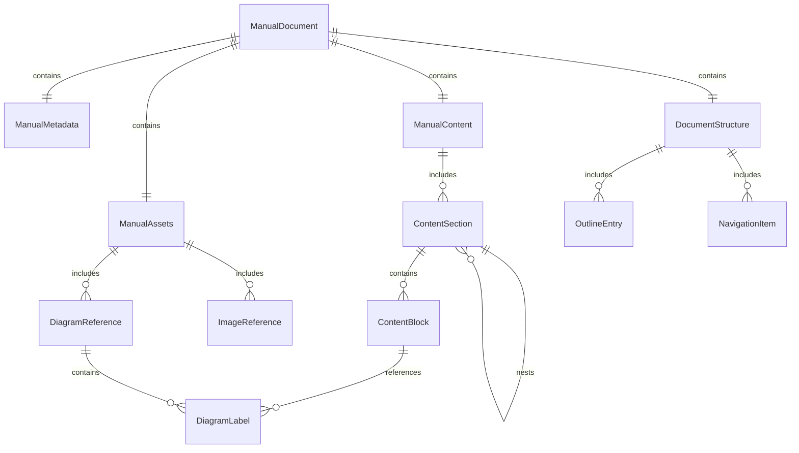

# Data Model: Bandai Manual Parser

**Date**: 2025-12-05
**Purpose**: Define structured data entities for parsed Bandai manual HTML files

## Core Entities

### ManualDocument

The root entity representing a complete parsed Bandai manual.

```typescript
interface ManualDocument {
  id: string;                    // Manual ID (e.g., "1234")
  metadata: ManualMetadata;      // Document-level metadata
  content: ManualContent;        // Structured content hierarchy
  assets: ManualAssets;          // Images, diagrams, and media
  structure: DocumentStructure;  // Navigation and outline
  extractedAt: string;           // ISO timestamp of extraction
  source: {
    url?: string;                // Original source URL if available
    htmlPath: string;            // Path to source HTML file
    htmlSize: number;            // Size of source file in bytes
  };
}
```

### ManualMetadata

Metadata extracted from the manual document.

```typescript
interface ManualMetadata {
  title: {
    ja: string;                  // Japanese title
    en?: string;                 // English translation if available
  };
  product: {
    name: string;                // Product name (e.g., "RX-78-2 Gundam")
    series?: string;             // Series (e.g., "Mobile Suit Gundam")
    grade?: string;              // Grade (HG, MG, PG, etc.)
    scale?: string;              // Scale (1/144, 1/100, etc.)
  };
  publication: {
    date?: string;               // Publication date
    version?: string;            // Manual version
    language: 'ja' | 'en' | 'mixed';  // Primary language
  };
  bandai: {
    categoryId?: string;         // Bandai category ID
    productId?: string;          // Bandai product ID
    manualId?: string;           // Bandai manual ID
  };
}
```

### ManualContent

Hierarchical content structure with sections and blocks.

```typescript
interface ManualContent {
  sections: ContentSection[];    // Document sections
  blocks: ContentBlock[];        // Flat list of all content blocks
  statistics: {
    totalSections: number;
    totalBlocks: number;
    wordCount: number;
    japaneseCharacterCount: number;
    imageCount: number;
  };
}

interface ContentSection {
  id: string;                    // Unique section identifier
  level: number;                 // Hierarchy level (1-6)
  title: {
    ja: string;                  // Japanese title
    en?: string;                 // English translation
  };
  blocks: ContentBlock[];        // Content blocks in this section
  subsections: ContentSection[]; // Nested sections
  pageNumber?: number;           // Page number in original manual
}

interface ContentBlock {
  id: string;                    // Unique block identifier
  type: BlockType;               // Type of content block
  content: string | BlockData;   // Block content
  metadata?: {
    className?: string;          // CSS class from original HTML
    pageNumber?: number;         // Page number reference
    footnote?: string;           // Footnote reference
  };
}

type BlockType =
  | 'heading'
  | 'paragraph'
  | 'list'
  | 'table'
  | 'image'
  | 'warning'
  | 'note'
  | 'instruction'
  | 'specification';

interface BlockData {
  // For different block types
  text?: string;                 // Text content
  items?: string[];              // List items
  rows?: TableRow[];             // Table data
  image?: ImageReference;        // Image data
  specifications?: SpecificationData;  // Spec data
}
```

### ManualAssets

References to images, diagrams, and other media.

```typescript
interface ManualAssets {
  images: ImageReference[];      // All images in the manual
  diagrams: DiagramReference[];  // Technical diagrams
  thumbnails: ThumbnailReference[];  // Thumbnail references
}

interface ImageReference {
  id: string;                    // Unique image identifier
  src: string;                   // Original image path or URL
  alt: {
    ja: string;                  // Japanese alt text
    en?: string;                 // English translation
  };
  type: 'illustration' | 'photo' | 'diagram' | 'symbol';
  size?: {
    width?: number;
    height?: number;
  };
  pageNumber?: number;           // Page number where image appears
}

interface DiagramReference extends ImageReference {
  type: 'diagram';
  labels: DiagramLabel[];        // Labels with coordinates
  annotations: DiagramAnnotation[];  // Callouts and notes
}

interface DiagramLabel {
  text: string;                  // Label text
  position: {
    x: number;                   // X coordinate (percentage)
    y: number;                   // Y coordinate (percentage)
  };
  target?: string;               // Reference target
}

interface DiagramAnnotation {
  id: string;                    // Annotation ID
  text: string;                  // Annotation text
  position: {
    x: number;
    y: number;
  };
  target?: string;               // What this annotation points to
}
```

### DocumentStructure

Navigation and outline information.

```typescript
interface DocumentStructure {
  outline: OutlineEntry[];       // Document outline
  navigation: NavigationItem[];  // Navigation structure
  pageCount?: number;            // Total pages if known
}

interface OutlineEntry {
  id: string;                    // Entry ID
  level: number;                 // Outline level
  title: string;                 // Entry title
  sectionId: string;             // Reference to section ID
  pageNumber?: number;           // Page number
  children: OutlineEntry[];      // Nested entries
}

interface NavigationItem {
  id: string;                    // Navigation ID
  type: 'page' | 'section' | 'chapter' | 'appendix';
  title: string;                 // Navigation title
  target: string;                // Target section ID
  order: number;                 // Order in navigation
}
```

## Validation Rules

### Japanese Text Validation

```typescript
// Japanese character patterns
const JAPANESE_PATTERNS = {
  hiragana: /[\u3040-\u309F]/,
  katakana: /[\u30A0-\u30FF]/,
  kanji: /[\u4E00-\u9FAF]/,
  japanese: /[\u3040-\u309F\u30A0-\u30FF\u4E00-\u9FAF\u3000-\u303F\uFF00-\uFFEF]/
};

// Validation rules
const JAPANESE_TEXT_RULES = {
  minLength: 1,
  maxLength: 1000,
  requiredPattern: JAPANESE_PATTERNS.japanese,
  normalization: 'NFC'  // Unicode normalization
};
```

### Field Validation

```typescript
// Core validation rules
const VALIDATION_RULES = {
  manualId: {
    pattern: /^\d+$/,
    minLength: 1,
    maxLength: 10
  },
  productGrade: {
    enum: ['HG', 'MG', 'PG', 'RG', 'EG', 'SD', 'RE', 'Mega Size']
  },
  productScale: {
    pattern: /^\d\/\d+$/,
    examples: ['1/144', '1/100', '1/60', '1/48']
  },
  pageNumber: {
    minimum: 1,
    maximum: 9999
  },
  coordinates: {
    minimum: 0,
    maximum: 100  // Percentage-based coordinates
  }
};
```

## State Transitions

### Processing States

```typescript
type ProcessingState =
  | 'pending'       // File discovered but not processed
  | 'processing'    // Currently being parsed
  | 'completed'     // Successfully processed
  | 'failed'        // Processing failed
  | 'retrying'      // Failed, retrying
  | 'validated'     // Processed and validated
  | 'indexed';      // Added to search index

interface ProcessingStatus {
  state: ProcessingState;
  startedAt?: string;
  completedAt?: string;
  attemptCount: number;
  lastError?: string;
  retryAfter?: string;
}
```

## Relationships

### Entity Relationships



### Data Flow

1. **Input**: HTML file with Japanese content
2. **Parse**: Extract structure and metadata using parse5
3. **Validate**: Apply Zod schemas for type safety
4. **Enrich**: Add navigation and structure information
5. **Output**: Structured JSON with validated data

## Indexing Strategy

### Search Optimization

```typescript
interface SearchIndex {
  documents: SearchDocument[];
  metadata: {
    totalDocuments: number;
    lastUpdated: string;
    version: string;
  };
}

interface SearchDocument {
  id: string;                    // Document ID
  title: string;                 // Searchable title
  content: string;               // Concatenated searchable content
  metadata: {
    grade?: string;              // Filterable metadata
    scale?: string;
    series?: string;
    language: string;
  };
  sections: SearchSection[];     // Searchable sections
}
```

This data model provides comprehensive structure for Bandai manual content while maintaining Japanese text integrity and supporting efficient processing at scale.